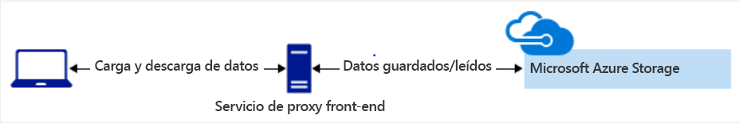
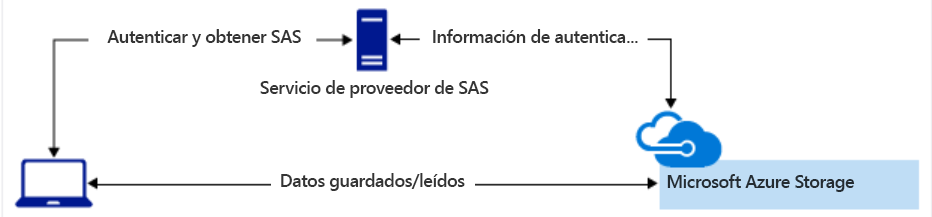
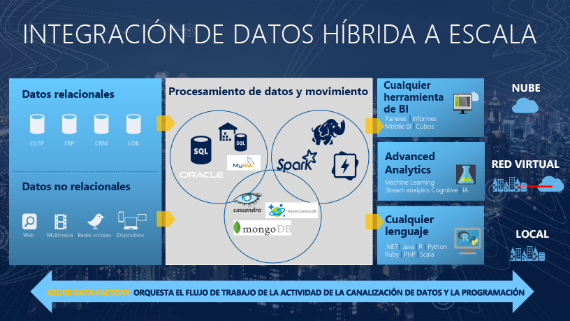

# **Microsoft Certified: Azure Data Engineer Asociate**
## **Temario**
- [**Microsoft Certified: Azure Data Engineer Asociate**](#microsoft-certified-azure-data-engineer-asociate)
  - [**Temario**](#temario)
  - [**Azure para ingenierio de datos**](#azure-para-ingenierio-de-datos)
    - [**Descripción del mundo cambiante de los datos**](#descripción-del-mundo-cambiante-de-los-datos)
      - [**Abundancia de datos**](#abundancia-de-datos)
      - [**Descripción de las diferencias entre los servidores locales y los basados en la nube**](#descripción-de-las-diferencias-entre-los-servidores-locales-y-los-basados-en-la-nube)
      - [**Descripción de las responsabilidad del trabajo**](#descripción-de-las-responsabilidad-del-trabajo)
    - [**Examinación de los servicios en la plataforma inteligente de datos Microsoft**](#examinación-de-los-servicios-en-la-plataforma-inteligente-de-datos-microsoft)
      - [**Exploración de tipos de datos**](#exploración-de-tipos-de-datos)
        - [**Datos estructurados**](#datos-estructurados)
        - [**Datos semiestructurados**](#datos-semiestructurados)
        - [**Datos no estructurados**](#datos-no-estructurados)
      - [**Descripción del almacenamiento de datos en Azure Storage**](#descripción-del-almacenamiento-de-datos-en-azure-storage)
      - [**Descripción del almacenamiento de datos en Azure Data Lake Storage**](#descripción-del-almacenamiento-de-datos-en-azure-data-lake-storage)
      - [**Descripción de Azure Cosmos DB**](#descripción-de-azure-cosmos-db)
      - [**Descripción de Azure SQL Database**](#descripción-de-azure-sql-database)
      - [**Descripción de Azure Synapse Analytics**](#descripción-de-azure-synapse-analytics)
      - [**Descripción de Azure Stream Analytics**](#descripción-de-azure-stream-analytics)
      - [**Descripción de Azure HDInsight**](#descripción-de-azure-hdinsight)
      - [**Definición de otros servcios de datos de Azure**](#definición-de-otros-servcios-de-datos-de-azure)
        - [**Azure Databricks**](#azure-databricks)
        - [**Azure Data Factory**](#azure-data-factory)
        - [**Microsoft Purview**](#microsoft-purview)
    - [**Identificación de las tareas de un ingeniero de datos en una arquitectura hospedada en la nube**](#identificación-de-las-tareas-de-un-ingeniero-de-datos-en-una-arquitectura-hospedada-en-la-nube)
  - [**Almacenamiento de datos en Azure**](#almacenamiento-de-datos-en-azure)
    - [**Selección de un enfoque de almacenamiento de datos en Azure**](#selección-de-un-enfoque-de-almacenamiento-de-datos-en-azure)
      - [**Clasificación de los datos**](#clasificación-de-los-datos)
      - [**Agrupación de varias operaciones en una transacción**](#agrupación-de-varias-operaciones-en-una-transacción)
        - [**Elección de una solución de almacenamiento en Azure**](#elección-de-una-solución-de-almacenamiento-en-azure)
    - [**Creación de una cuenta de Azure Storage**](#creación-de-una-cuenta-de-azure-storage)
      - [**Determinación del número de cuentas de almacenamiento necesarias**](#determinación-del-número-de-cuentas-de-almacenamiento-necesarias)
    - [**Conexión de una aplicación a Azure Storage**](#conexión-de-una-aplicación-a-azure-storage)
      - [**Exploración de los servicios de Azure Storage**](#exploración-de-los-servicios-de-azure-storage)
        - [**Datos BLOB**](#datos-blob)
        - [**Files**](#files)
        - [**Queues**](#queues)
      - [**Interacción con las API de Azure Storage**](#interacción-con-las-api-de-azure-storage)
      - [**Conexión a la cuenta de Azure Storage**](#conexión-a-la-cuenta-de-azure-storage)
    - [**Protección de la cuenta de Azure Storage**](#protección-de-la-cuenta-de-azure-storage)
      - [**Exploración de las características de seguridad de Azure Storage**](#exploración-de-las-características-de-seguridad-de-azure-storage)
      - [**Descripción de las firmas de acceso compartido**](#descripción-de-las-firmas-de-acceso-compartido)
      - [**Control de acceso de red a la cuenta de almacenamiento**](#control-de-acceso-de-red-a-la-cuenta-de-almacenamiento)
      - [**Información sobre Advanced Threat Protection para Azure Storage**](#información-sobre-advanced-threat-protection-para-azure-storage)
      - [**Exploración de las características de seugridad de Azure Data Lake Storage**](#exploración-de-las-características-de-seugridad-de-azure-data-lake-storage)
    - [**Almacenamiento de datos de aplicaciones con Azure Blob Storage**](#almacenamiento-de-datos-de-aplicaciones-con-azure-blob-storage)
      - [**¿Qué son los blobs?**](#qué-son-los-blobs)
      - [**Diseño de una estrategia de organización de almacenamiento**](#diseño-de-una-estrategia-de-organización-de-almacenamiento)
  - [**Integración de datos a escala con Azure Data Factory o canalización de Azure Synapse**](#integración-de-datos-a-escala-con-azure-data-factory-o-canalización-de-azure-synapse)
    - [**Integrar datos con Azure Data Factory o canalización de Azure Synapse**](#integrar-datos-con-azure-data-factory-o-canalización-de-azure-synapse)
      - [**Conocer Azure Data Factory**](#conocer-azure-data-factory)
      - [**Descripción de los patrones de integración de datos**](#descripción-de-los-patrones-de-integración-de-datos)
    - [**Ingesta a escala de petabytes con Azure Data Factory o una canalización de Azure Synapse**](#ingesta-a-escala-de-petabytes-con-azure-data-factory-o-una-canalización-de-azure-synapse)
    - [**Realización de transformaciones sin código a escala con Azure Data Factory o una canalización de Azure Synapse**](#realización-de-transformaciones-sin-código-a-escala-con-azure-data-factory-o-una-canalización-de-azure-synapse)
    - [**Relleno de dimensiones de variación lenta en canalizaciones de Azure Synapse Analytics**](#relleno-de-dimensiones-de-variación-lenta-en-canalizaciones-de-azure-synapse-analytics)
    - [**Orqueste el movimiento y la transformación de datos en Azure Data Factory o en las canalizaciones de Azure Synapse**](#orqueste-el-movimiento-y-la-transformación-de-datos-en-azure-data-factory-o-en-las-canalizaciones-de-azure-synapse)
    - [**Ejecución de paquetes SSIS existentes en la canalización de Azure Data Factory o Azure Synapse**](#ejecución-de-paquetes-ssis-existentes-en-la-canalización-de-azure-data-factory-o-azure-synapse)
    - [**Puesta en marcha de canalizaciones de Azure Data Factory o Azure Synapse**](#puesta-en-marcha-de-canalizaciones-de-azure-data-factory-o-azure-synapse)
  - [**Obtención de soluciones analíticas integradas con Azure Synapse Analytics**](#obtención-de-soluciones-analíticas-integradas-con-azure-synapse-analytics)
  - [**Trabajo con almacenamientos de datos con Azure Synapse Analytics**](#trabajo-con-almacenamientos-de-datos-con-azure-synapse-analytics)
  - [**Realización de tareas de ingeniería de datos con grupos de Apache Spark en Azure Synapse**](#realización-de-tareas-de-ingeniería-de-datos-con-grupos-de-apache-spark-en-azure-synapse)
  - [**Uso de soluciones de procesamiento analítico y transaccional híbridas mediante Azure Synapse Analytics**](#uso-de-soluciones-de-procesamiento-analítico-y-transaccional-híbridas-mediante-azure-synapse-analytics)
  - [**Ingeniería de datos con Azure Databricks**](#ingeniería-de-datos-con-azure-databricks)
  - [**Procesamiento de datos de gran escala con Azure Data Lake Storage Gen2**](#procesamiento-de-datos-de-gran-escala-con-azure-data-lake-storage-gen2)
  - [**Implementación de una solución de streaming de datos con Azure Stream Analytics**](#implementación-de-una-solución-de-streaming-de-datos-con-azure-stream-analytics)
## **Azure para ingenierio de datos**
### **Descripción del mundo cambiante de los datos**
#### **Abundancia de datos**
- Incremento exponencial de dispositivos y software que generan datos
- Las empresas almacenan, interpretan, administran, transforman, procesan, agregan y notifican estos datos a partes interesadas.
- Los datos pueden ser estructurados, no estructurados o agregados.
- Los Data Engineer deben mantener los sistemas de datos para que sean precisos, seguros y disponibles initerrumpidamente.
- Los sistemas deben cumplir leyes aplicables, como *Reglamento General de Proteicción de Datos* y los estándares del sector como *Payment Card Industry Data Security Standard*. Además de otros requisitos como formato de fecha e idioma local.
#### **Descripción de las diferencias entre los servidores locales y los basados en la nube**
*Se plantean proyectos de transformación digital ante la inminencia del final del ciclo de vida de su infraestructura y hardware de TI tradicional*  
Característica|Entorno Local|Entorno de Nube
---|---|---
Entorno informático|Requiere equipo físico, infraestructura de red y almacenamiento para ejecutar aplicaciones y servivicios. Además, refrigeración, alimentación eléctrica y mantenimiento periódico. Un servidor necesita almenos un SO instalado, y si se usa tecnología de virtualización, se necesite más de un SO.|Proporcionan infraestructura física y lógica para hospedar servicios, aplicaciones y contenedores. No requieren inversión de capital, solo se aprovisiona el servicio y se paga su uso.
Licencias|Cada SO instalando en un servidor tiene costos de licencia propios| Asociadas al costo operativo o reusar las que tiene la empresa.
Mantenimiento|Al hardware, firmware, controladores, BIOS, SO, software y antivirus. Siempre se intenta reducir el costo donde tenga sentido.|Microsoft administra muchas de los servicios de infraestructura clave, dependiendo el modelo de servicio (IaaS,PaaS,SaaS). Además de invertir en amenazas de ciberseguridad, actualizando SO y Firmware en nombre del cliente.
Escalabilidad|Cuando los administradores no puedan escalar verticalmente, se optará por hacerlo horizontalmente. De esta última forma, se agrega otro nodo de servidor a un clúster. Y para la agrupación en clústeres se usa un equilibrador de carga de hardware o de software para distribuir solicitudes de red entrantes a un nodo. El hardware de cada servidor del clúster debe ser idéntico, y cuando se alcanza la capacidad máxima, se debe reemplazar o actualizar cada nodo del clúster.|Simple a un clic, y se mide en unidades de proceso.
Disponibilidad|Descrito en contratos de nivel de servicio (SLA) que especifican las expectativas de disponibilidad de la organización|Azure duplica el contenido de clientes para ofrecer redudancia y alta disponibilidad.
Soporte técnico|Existen cientos de proveedores que venden hardware de servidor físico. Esta variedad implica que los administradores conozcan como funcionan muchas plataformas diferentes. Haciendo dificil encontrar y contratar administradores de servidores.|Los sistemas están estándarizados en Microsoft, portal un producto actualizado se aplica a todos los consumidores del producto.
Compatibilidad con varios idiomas|Aplicaciones como SQL Server permiten este manejo. Sin embargo, deben ser pensados desde la creación del servidor para evitar problemas de conversión y almacenamiento de datos en distintos idiomas.|Los sistemas de nube almacenan archivos JSON con datos que incluyen el identificador de código de idioma (LCID). El LCID identifica el idioma que usan los datos. Las aplicaciones que procesna datos pueden usar servicios de traducción como Bing Translator API para convertir datos a un idioma cuando se consumen los datos.
Coste total de propiedad|De una tecnología determinada, en sistemas locales incluye hardware, licencias de software, personal (instalación, actualización y mantenimiento), costos generales del centro de datos (energía, telecomunicación, creación, calefacción y refrigeración). Aún así es dificil alinear los gastos derivados del entorno local con el uso real, pues se compran servidores que tienen una capacidad mayor a la que necesitas para poder adaptarse a un posible crecimiento futuro. Este costo se capitaliza, y hace dificil actualizar durante la duración esperada de un servidor.|Los sistemas de nube como Azure realizan seguimiento de los costos a través de las suscripciones. Basadas en el uso medido en unidades de proceso, horas o transacciones. El costo incluye hardware,software,almacenamiento en disco y mano de obra. Como consecuencia de la economía de escala, es difícil que un sistema local pueda competir con la nube en precios y medición del uso de servicio.
#### **Descripción de las responsabilidad del trabajo**
- Administrar sistemas de datos en la nube.
- Trabajar también con datos no estructurados y una amplia variedad de tipos de datos nuevos, como los de transmisión.
**Procesos de cambio de datos**
- Extraer datos sin procesar de un grupo de datos, y migrarlos a un repositorio de datos de almacenamiento privisional. 
- En el camino transformar la estructura del esquema de origen al esquema de destino y luego cargarlos, es decir el proceso ETL.
- Otro enfoque, que evita el uso de recursos del sistema de origen es ELT.
**De la implementación al aprovisionamiento de servidores**
- Implementar servicios de manera sencilla o automatiza mediante una interfaz web o scripts eficaces.
### **Examinación de los servicios en la plataforma inteligente de datos Microsoft**
#### **Exploración de tipos de datos**
##### **Datos estructurados**
- Se definen en tiempo de diseño
- En forma de tablas
- Existe un esquema antes de cargar la información en el sistema
- La estructura de datos incluye el modelo relacional, la estructura de tabla, ancho de columna y tipos de datos
- Reaccionan con lentitud a los cambios en los requisitos de los datos.
##### **Datos semiestructurados**
- Archivos binarios que por medio de un protocolo de lectura o estándar de definición de datos mantienen una estructura o esquema casi fijo.
- Son soportados por sistemas SQL y NoSQL.
##### **Datos no estructurados**
- Se incluyen archivos de imágen, audio y binarios, y se almacenan en sistemas no estructurados o NoSQL. La estructura de los datos no se define en tiempo de diseño, y los datos se cargan en formato sin procesar.
- La estructura de los datos solo se define cuando se leen.
- Existen cuatro tipos de bases de datos NoSQL:
  - Almacén de pares clave-valor
  - De documentos
  - De grafos
  - De columnas
#### **Descripción del almacenamiento de datos en Azure Storage**
- Cuentas de Azure Storage son el tipo de almacenamiento básico: de objetos, sistema de archivos para la nube, almacén de mensajería, o almacén NoSQL.
**Azure Storage: Opciones de configuración**:
Opción|Descripción
---|---
Azure Blob|Datos de texto y binarios
Azure Files|Recursos compartidos de archivos en local y nube
Azure Queue|Mensajería entre componentes de aplicación
Azure Tables|Almacenamiento NoSQL de datos no estructurados (sin esquema)

> Azure Storage también es usado para aprovisionar una tecnología de plataforma de datos: Azure Data Lake Storage y HDInsight.
**¿Cuándo usar Blob Storage?**
- Almacenar datos, pero no se van a consultar.
**Características principales**
- Proporciona API REST y SDK en varios lenguajes (.NET, Node.js, Java, Python, PHP, Ruby y Go)
- Admite scripting en Azure PowerShell y CLI de Azure.
**Ingesta de datos**
- Azure Data Factory
- Explorador de Azure Storage
- Herramienta AzCopy, PowerShell o Visual Studio
**Seguridad de los datos**
- Cifrados al almacenarse
- Protección mediante claves o firmas de acceso compartido(Limita a aplicaciones o usuarios)
- ARM proporciona RBAC que se puede aplicar en Azure Storage
#### **Descripción del almacenamiento de datos en Azure Data Lake Storage**
- Repositorio compatible con Hadoop
- Optimizado en rendimiento para procesar soluciones de análisis de macrodatos
- Acceso a datos a través de Blob API o Data Lake File API
- Actuar como capa de almacenamiento para una amplia gama de plataformas de procesamiento: Azure Databricks, Hadoop, Azure HDInsight, volviendo no necesario cargar los datos a las plataformas.
- Reduce los tiempos de cálculo
**Características principales**
- Compatibilidad con Hadoop
- Compatibilidad de seguridad con ambas listas de control de acceso (RBAC, ACL)
- Compatibilidad con POSIX
**Ingesta de datos**
- Los mismos que Blob Storage, incluyendo ahora Apache Sqoop
**Consultas**
- En Gen1 se usaba U-SQL
- En Gen2 se usa Azure Blob Storage API o Azure Data Lake System (ADLS) API
**Seguridad de los datos**
- Compatible con las listas de control de acceso (ACL) de Azure Active Directory, mediante grupos de seguridad de Active Directory
- Control de acceso basado en rol (RBAC) disponible: ReadOnlyUsers, WriteAccessUsers y FullAccessUsers
#### **Descripción de Azure Cosmos DB**
- Base de datos de varios modelos distribuida globalmente
- Implementar mediante varios modelos de API:
  - API SQL
  - MongoDB API
  - Cassandra API
  - API de Gremlin
  - Table API
**Características principales**
- Hasta 99,999% de SLA
- Conmuta por error de forma automática ante desastre regional
- Replicación multimaestro garantiza tiempos de respuesta menores a 10ms para lectura y escritura.
- La coherencia de los datos se presenta en niveles:
  - Alta
  - Uso vinculado
  - Sesión
  - Prefijo coherente
  - Ocasional
**Ingesta de datos**
- Azure Data Factory
- Aplicación que escriba en Azure CosmosDB a través de su API
- Cargar documentos JSON
- Editar directamente el documento
**Consultas**
- Mediante procedimientos almacenados, desencadenadores y funciones definidas por el usuario (UDF).
- JavaScript Query API
- componente Explorador de datos (Visualización de gráficos)
**Seguridad de los datos**
- Admite cifrado de datos
- Configuraciones de firewall de IP
- Acceso desde redes virtuales
- Autenticación basada en tokens
- Azure Active Directory proporciona seguridad basada en rol
#### **Descripción de Azure SQL Database**
- Base de datos relacional administrado y formatos no estructurados como XML y datos espaciados (CSV,TSV,etc).
- Ofrece OLTP que puede escalar a petición
**Ingesta y procesamiento de datos**
- SDK´s
- Transact-SQL (T-SQL)
- Azure Data Factory
**Seguridad de los datos**
- Protección contra amenazas avanzadas
- Auditoria de SQL Database
- Cifrado de datos
- Autenticación con Azure Active Directory
- Multi-Factor Authentication
- Certificación de cumplimiento
#### **Descripción de Azure Synapse Analytics**
- Plataforma de datos: Combina almacenamiento de datos empresariales y el análisis de macrodatos
**Características principales**
- Grupos de SQL se usa procesamiento paralelo masivo (MPP) para ejecutar consultas
- Servicio de movimiento de datos (DMS) coordina y transporta datos entre los nodos de proceso.
> Puede usarse tabla replicada para reducir movimiento de datos y mejorar rendimiento. 3 tipos de tablas: hash, round robin y replicadas.
- La capa de proceso puede ser "pausada" y "reanudada", pagando solo el proceso que se usa.
**Ingesta y procesamiento de datos**
- Usa ELT. Se tienen herramientas de copia masiva como "bcp" y la API SQLBulkCopy, pero en Synapse existe PolyBase
- Uso de PolyBase para ingesta y procesamiento de datos mediante descarga de cálculos complejos en la nube. Aplican procedimientos almacenados, etiquetas, vistas y SQL a sus aplicaciones
- Azure Data Factory
**Consultas**
- Transact-SQL
**Seguridad de los datos**
- Autenticación de SQL Server
- Autenticación de Azure Active Directory
- A nivel de datos, Synapse admite seguridad nivel columnas y filas.
#### **Descripción de Azure Stream Analytics**
- Aplicaciones, sensores, dispositivos de suerpvisión y puertas de enlace difunden datos de eventos continuos: Conocidos como *flujo de datos*. (Estos datos de streaming, tienen un volumen elevado pero carga ligera).
- Se usa Azure Stream Analytics para procesar datos de streaming y responder en tiempo real.
**¿Cuándo usar Stream Analytics?**
- Debe responder a eventos de datos en tiempo real
- Analizar grandes lotes de datos en un flujo continuo de tiempo limitado
**Ingesta de datos**
- Debe configurar entradas de datos de orígenes de integración de primera clase. Incluye **Azure Event Hubs**, **Azure IoT Hub** y **Azure Blob Storage**.
**Procesamiento de datos**
- Debe configurar Stream Analytics con canalizaciones de entrada y salida
- Entradas proceden de Event Hubs, IoT Hub o Azure Sotrage
- La salida puede enrutarse a muchos sistemas de almacenamiento: Azure Blob Storage, Azure SQL Database, Azure Data Lake Storage y Azure Cosmos DB.
- Luego de almacenados, ejecutar análisis por lotes en Azure HDInsight, o consumido por Event Hubs. O bien, usar Power BI Streaming API
**Consultas**
- Lenguaje de consulta simple y declarativo de Stream Analytics - Coherente con lenguaje SQL
**Seguridad de los datos**
- Controla la seguridad en la capa de transporte entre dispositivo y Azure IoT Hub.
- En Event Hubs se usa clave compartida para proteger transferencia de datos
#### **Descripción de Azure HDInsight**
- Proporciona tecnologías para ingesta, procesamiento y análisis de macrodatos
- Admite procesamiento por lotes, almacenamiento de datos, IoT y ciencia de datos.
- Incluye: Apache Hadoop, Spark, Kafka, HBase, Storm e Interactive Query.
**Ingesta de datos**
- Usar Hive para ejecutar operaciones de ETL en los datos u orquestar las consultas de Hive en Azure Data Factory
**Procesamiento de datos**
- Hadoop;: Java, Python
- Spark: Java, Scala, Python, R
- Storm: Java, C#, Python
**Consultas**
- Hadoop: Pig, HiveQL
- Spark: SparkSQL
**Seguridad de los datos**
- Hadoop es compatible con cifrado, Secure Shell (SSH), firmas de acceso compartido y la seguridad de Azure Active Directory
#### **Definición de otros servcios de datos de Azure**
##### **Azure Databricks**
- Plataforma de análisis de datos optimizada para Azure
- Área de trabajo interactiva para aplicaciones basadas en Spark
- Use seguridad basada en rol de Azure Active Directory y Databricks de clase empresarial.
##### **Azure Data Factory**
- Servicio de integración en nube. Orquesta movimiento de datos entre repositorios de datos
- Permite crear flujos de trabajo controlados por datos, para orquestar y automatizar tanto movimiento como la transformación de los datos.
- Los flujos de trabajo controlados por datos son denominados **canalizaciones** o **pipelines**
- Puede procesar y transformar los datos mediante **servicios de procesamiento**, como Azure HDInsight, Hadoop, Spark, Azure Machine Learning o sus transformaciones nativas.
##### **Microsoft Purview**
- Reune la antigua versión de **Azure Purview** y la antigua cartera de **Cumplimiento de Microsoft 365**
- Conjunto completo de soluciones que ayudan a gobernar, proteger y administrar todo el patrimonio de datos.
- Crear mapa holístico y actualizado del panorama de sus datos con detección automatizada de datos, clasificación de datos confidenciales y linaje de datos completo.
### **Identificación de las tareas de un ingeniero de datos en una arquitectura hospedada en la nube**
Proximamente (No muy relevante)
## **Almacenamiento de datos en Azure**
### **Selección de un enfoque de almacenamiento de datos en Azure**
#### **Clasificación de los datos**
- Estructurados, Semiestructurados y No Estructurados
**Datos estructurados**
- Denominados *datos relacionales*
- Idóneo para sistemas CRM, reservas y administración de inventarios.
- Al forzar una estructura coherente, implica una evolución de datos más complicada
**Datos semiestructurados**
- Contienen etiquetas que hacen evidentes la organización y jerarquía de los datos. Ejemplo: pares clave-valor (donde un valor puede ser una colección de claves-valores)
- Denominados también como *datos no relacionales* o *datos NoSQL*
- Se definen mediante un lenguaje de serialización
- **Serialización es el proceso de conversión de datos a un formato que se pueda transmitir o almacenar**
- Comunes son **XML, JSON** y **YAML**.
**Datos no estructurados**
- Organización indefinida, entregada en formato de archivo, como fotos o vídeos.
- El archivo podría tener una estructura general e incluir metadatos semiestructurados, pero los datos que forman el vídeo en sí mismo no están estructurados
#### **Agrupación de varias operaciones en una transacción**
- Si un cambio en un fragmento de datos debe tener como resultado un cambio en otro, una aplicación tendrá que agrupar una serie de actualizaciones ded atos. Las *transacciones* las agrupan.
- En una *transacción*, si se produce un error en un evento de una serie de actualizaciones, toda la serie se puede revertir o deshacer.
- Las *transacciones* se definen mediante un conjunto de *garantías ACID*.
  - *Atomicidad*: Ejecutarse una vez y debe ser atómica.
  - *Coherencia*: Datos coherentes tanto antes como después de la transacción.
  - *Aislamiento*: Cada transacción no se ve afectada por otras transacciones.
  - *Durabilidad*: Cambios realizados como resultado de una transacción se guardan de forma permanente en el sistema. En caso de error o reinicio del sistema, están disponibles en su estado correcto.
**Diferencias entre OLTP y OLAP**
- Bases de datos transaccionales -> Sistemas de procesamiento de transacciones en línea (OLTP):
  - Admiten muchos usuarios
  - Tiempos de respuestas rápidos
  - Controlan grandes volúmenes de datos y transacciones pequeñas o sencillas.
  - Alta disponibilidady tiempo de inactividad mínimo
- Sistemas de procesamiento analítico en línea (OLAP):
  - Admiten menos usuarios
  - Tiempos de respuesta más largos
  - Disponibilidad menor
  - Controlan grandes y complejas transacciones
> Los términos OLTP y OLAP ya no se usan con tanta frecuencia como antes
##### **Elección de una solución de almacenamiento en Azure**
- Azure Cosmos DB: Para casos de catálogo de productos que requieran ampliar o modificar el esquema para nuevos productos.
- Azure Storage: Almacenar fotos y vídeos. Además de poder integrar con Azure Content Delivery Network al almacenar en caché el contenido más usado y guardarlo en servidores perimetrales.
- Azure SQL Database y Azure Analysis Servces: Para datos empresariales
### **Creación de una cuenta de Azure Storage**
#### **Determinación del número de cuentas de almacenamiento necesarias**
- **¿Qué es Azure Storage?**: Servicio de almacenamiento primitivo. Blobs, Files, Queues y Tables.
- **¿Qué es una cuenta de almacenamiento?**: Contenedor que agrupa los conjuntos de servicio primitivos de almacenamiento de Azure.
- **¿Cuántas cuentas de almacenamiento necesita?**: Determinado por la diversidad de datos, susceptibilidad a costos y tolerancia para la sobrecarga de administración. Considerar datos de un país, región, propiedad o consumo público.
> Mayor diversidad en los datos se traduce en un aumento de número de cuentas de almacenamiento
- **Susceptibilidad a los costos**:
  - Una cuenta de almacenamiento no cuesta. Dependiendo su configuración aumenta el costo de los contenedores que se encuentran dentro
  - Para reducir costos, se crean varias cuentas. 
### **Conexión de una aplicación a Azure Storage**
#### **Exploración de los servicios de Azure Storage**
Tipos de datos en los servicios de almacenamiento de Azure:
- Blobs
- Archivos
- Colas
- Table Storage
##### **Datos BLOB**
Ideal para:
- Suministrar archivos directamente a un explorar, incluido sistios web estáticos completos
- Streaming de audio y video
- Almacenamiento de datos para el análisis por un servicio local
**Tipos de blobs**
Tipo de blob|Descripción
---|---
Blobs en bloques|Contener archivos de texto o binarios de hasta ~5TB(50 000 bloques de 100MB) de tamaño. Caso de uso principal para archivos que se leen de principio a fin. Se llaman en bloques, porque archivos de más de 100 MB deben cargarse como pequeños bloques. Estos bloques, se consolidan en un blob final.
Blobs en páginas|Contener archivos de acceso aleatorio de hasta 8TB de tamaño. Lectura y escritura a páginas de 512 bytes. Usado principalmente como almacenamiento de seguridad de los discos duros virtuales para Azure Virtual Machines
Blobs en anexos|Constan de bloques, pero optimizados para operaciones de anexión. Usados para registrar información de uno o más orígenes en el mismo blob. Puede tener hasta 195GB.
##### **Files**
- Configurar recursos compartidos de archivos de red, acesibles mediante protocolo estándar Bloque de mensajes del servidor (SMB). 
- Significa que varias VM´s pueden compartir mismos archivos con acceso de lectura y escritura.
##### **Queues**
- Almacena y recupera mensajes.
- Tamaño de hasta 64KB y una cola puede contener millones de mensajes
- Almacenan listas de mensajes y se procesan de forma asincrónica.
#### **Interacción con las API de Azure Storage**
- Cada tipo de dato que puedes almacenar tiene su propia API independiente (Blob,Cola,Tabla,File)
- Azure disponibiliza una API REST de Storage donde enviar una solicitud HTTP/HTTPS y recibir una respuesta HTTP/HTTPS
- Brinda además bibliotecas cliente que pueden guardar cantidad significativa de trabajo de las API ahorrando pasos. Disponibles en:
  - .NET
  - Java
  - Python
  - Node.js
  - Go
#### **Conexión a la cuenta de Azure Storage**
- Para trabajar con datos en una cuenta de almacenamiento, la aplicación necesitará dos conjuntos de datos:
  - Claves de acceso
  - Punto de conexión de la API REST
**Claves de acceso**
- Cada cuenta de almacenamiento tiene 2 claves
**Punto de conexión de la API REST**
- Es una combinación del nombre de la cuenta de almacenamiento, tipo de dato y un dominio conocido. Ejemplo:
  - `https://[name].blob.core.windows.net/`
  - Si tiene un dominio personalizado vinculado a Azure, puede crear una dirección URL de dominio personalizado para el punto de conexión
**Cadenas de conexión**
- Proporciona toda la información de conectividad necesaria en una única cadena de texto. Ejemplo  
```bash
DefaultEndpointsProtocol=https;AccountName={your-storage};
   AccountKey={your-access-key};
   EndpointSuffix=core.windows.net
```
**Seguridad**
- Las claves de las cuentas de almacenamiento brindan acceso a toda esta, y se debe proporcionar solo a sistemas o usuarios confiables.
- Cada cuenta tiene 2 claves, pudiendo alternar periódicamente como parte del procedimiento recomendado de seguridad.
**Firmas de acceso compartido (SAS)**
- Mecanismo de autenticación independiente denominado *firmas de acceso compartido* que admite expiración y limitación de los permisos en escenarios donde deba limitarse el acceso
### **Protección de la cuenta de Azure Storage**
#### **Exploración de las características de seguridad de Azure Storage**
- Cifrado en reposo: Mediante Storage Service Encryption (SSE) con cifrado Estándar de cifrado avanzado (AES) de 256 bits, compatible con FIPS 140-2.
> Cifrar y Descifrar los datos no supone cargo adicional.
- En las VM, Azure permite cifrar los discos duros virtuales (VHD) mediante Azure Disk Encryption. (Este cifrado usa imágenes de BitLocker en Windows y dm-crypt para Linux)
- Cifrado en tránsito: Habilitar la *seguridad de nivel de transporte*. Esta marca aplica la transferencia segura desde API de REST por HTTPS, y a través de SMB al exigir SMB 3.0 para todos los montajes de recursos compartidos de archivos. 
- Compatibilidad con CORS: Las aplicaciones web se aseguran de cargar únicamente contenido autorizado de fuentes autorizadas.
- Control de acceso basado en rol (RBAC): Cada solicitud a un recurso seguro debe autorizarse, garantizando que el cliente tenga los permisos necesarios para acceder a los datos. Puede seleccionar muchas opciones:
  - Control de acceso basado en rol para operaciones de administración de recursos y de datos
  - Azure Active Directory para autorizar operaciones de administración de recursos como la configuración.
- Auditoría de acceso: Puede auditar el acceso de Azure Storage usando el servicio Storage Analytics integrado.
#### **Descripción de las firmas de acceso compartido**
- No se recomienda compartir claves de cuentas de almacenamiento con aplicaciones de terceros. Para eso es mejor usar una firma de acceso compartido (SAS). 
- Una SAS es una cadena que contiene un token de seguridad que se asocia a un URI. Usar un SAS permite delegar el acceso a objetos de almacenamiento y específicar restricciones, como los permisos y el intervalo de tiempo de acceso.
**Tipos de firmas de acceso compartido**
- SAS de *nivel de servicio*: Permitir el acceso a recursos específicos de una cuenta de almacenamiento
- SAS de *nivel de cuenta*: Permite todo lo que permita un SAS de nivel de servicio, además de a otros recursos y capacidades
**Uso de SAS**
- Un SAS normalmente se usraía para un servicio en el que los usuarios leyeran y escibieran sus datos en la cuenta de almacenamiento.
**Diseños típicos de cuentas que almacenan datos de usuario**:
- Clientes cargan y descargan datos mediante un servicio de proxy de front-end que realiza la autenticación. Este servicio puede permitir validar reglas de negocio, pero no óptimo en costos si debe controlar grandes cantidades de datos o transacciones de gran volumen.


- Un servicio ligero autentica al cliente según necesidad. Genera un SAS, reenvia al cliente este y este último puede acceder a los recursos de la cuenta de almacenamiento directamente. Reduce la necesidad de enrutar todos los datos a través del servicio de proxy de front-end


#### **Control de acceso de red a la cuenta de almacenamiento**
- Predeterminado: las cuentas aceptan conexión de clientes de cualquier red.
- Para cambiar, se puede restringir el acceso a determinadas direcciones IP, intervalos o redes virtuales.
#### **Información sobre Advanced Threat Protection para Azure Storage**
- Microsoft Defender para Storage.
- Detecta intentos inusuales y potencialmente dañinos de acceso a cuentas de almacenamiento o de aprovechar sus vulnerabilidades.
- Microsoft Defender para Storage se integra con las alertas de seguridad de Microsoft Defender for Cloud.
**Exploración de anomalías de seguridad**  
Al producirse una, recibirá una notificación por e-mail acerca del evento. Los detalles incluirán:
- Naturaleza de la anomalía
- Nombre de la cuenta de almacenamiento
- Hora del evento
- Tipo de almacenamiento
- Posibles causas
- Pasos de investigación
- Pasos para la corrección
- El correo electrónico también incluye detalles sobre las posibles causas y las acciones recomendadas para investigar y mitigar la posible amenaza.
#### **Exploración de las características de seugridad de Azure Data Lake Storage**
- Al basarse en Azure Blob Storage, hereda todas las características de seguridad: Claves, SAS, RBAC, Microsoft Defender for Storage.
- Junto con RBAC, Azure Data Lake Storage Gen2 (ADLS Gen2) proporciona listas de control de acceso (ACL) compatibles con POSIX que restringen el acceso a los usuarios, los grupos o las entidades de servicio autorizados.
- ADLS Gen2 autentica mediante tokens de portador de Azure AD OAuth 2.0. Incluye federación con Azure AD Connect y autenticación multifactor.
- Estos esquemas de autenticación están integrados en los servicios de análisis principales que usan los datos: Azure Databricks, HDInsight y Azure Synapse Analytics. 
### **Almacenamiento de datos de aplicaciones con Azure Blob Storage**
#### **¿Qué son los blobs?**
- *Archivos para la nube* y *no estructurados*
- Sin restricción en cuanto a los tipos de datos que puede contener
- No son eficaces para datos estructurados que se deben consultar con frecuencia. Pues tiene una latencia mayor que la memoría y discos locales y no tienen características de indexación que hacen que las bases de datos sean eficaces para la ejecución de consultas.
**Cuentas de almacenamiento, contenedores y metadatos**
- Los blobs residen dentro de un *contenedor de blobs*
- En una cuenta de almacenamiento se pueden almacenar número ilimitado de contenedores, y en cada uno, ilimitados blobs.
- Los contenedores son planos, no almacenan otros contenedores
- Los contenedores y blobs admiten metadatos en forma de pares de cadenas de nombre-valor. Las aplicaciones pueden estarlos para lo que quieran. Ejemplo: descripción legible del contenido del blob, cadena que indica como procesar el blob,etc.
> Blob Storage no proporciona ningún mecanismo para buscar u ordenar los blobs por metadatos. Para tal uso, lea sobre **Azure Cognitive Search**

#### **Diseño de una estrategia de organización de almacenamiento**
- Importante pensar como una aplicación va a organizar en blobs, contenedores y cuentas de almacenamiento.
**Cuentas de almacenamiento**
- Necesario para separar costes y acceso de control a datos de forma lógica
**Contenedores y blobs**
- Estrategia de nomenclatura y organización de contenedores y blobs
- Uso de identificadores como GUI en nombres, y una referencia en una base de datos en registros.
- Otros usos: añadir extensiones de nombres de archivo `.jpg` o usar directorios virtuales para organizar los blobs. Por último usar con frecuencia las etiquetas de metadatos para almacenar información sobre los blobs y contenedores.
**Limitaciones sobre nomenclatura**
- Los blobs deben seguir limitaciones de longitud y restricciones de caracteres
**Acceso público y contenedores como límites de seguridad**
- Predeterminado: todos los blobs requieren autenticación para acceder.
- Se pueden configurar contenedores individuales para permitir descarga pública sin autenticación
**Prefijos de nombres de blob (directorios virtuales)**
- Si los blobs contienen nombres jerárquicos, la operación de enumeración de la API puede filtrar los resultados de los prefijos específicos. 
## **Integración de datos a escala con Azure Data Factory o canalización de Azure Synapse**
### **Integrar datos con Azure Data Factory o canalización de Azure Synapse**
#### **Conocer Azure Data Factory**
- Servicio de integración de datos y ETL basado en nube
- Organiza el movimiento y transformación de datos entre varios *almacenes de datos* y *recursos de proceso*
- Integra datos mediante *flujos de trabajo* (llamados pipeline o canalizaciones), que se pueden crear y programar.
- En los *flujos de trabajo* se compilan procesos ETL complejos que transforman datos visualmente con flujos de datos (**Data Flow**, herramienta visual) o mediante uso de servicios de proceso como **Azure HDInsight Hadoop**, **Azure Databricks** y **Azure Synapse Analytics**
> Gran parte de la funcionalidad de Azure Data Factory aparece en Azure Synapse Analytics como una característica denominada "pipeline" o "canalización". Permite integrar canalizaciones de datos entre grupos de SQL, Spark y SQL serverless.
**Qué significa orquestación**
- ADF tiene un enfoque similar a una orquesta sinfónica:
  - Dirige a los miembros
  - Conoce todo el contexto
  - Provee de valores específicos a cada componente



#### **Descripción de los patrones de integración de datos**

### **Ingesta a escala de petabytes con Azure Data Factory o una canalización de Azure Synapse**
### **Realización de transformaciones sin código a escala con Azure Data Factory o una canalización de Azure Synapse**
### **Relleno de dimensiones de variación lenta en canalizaciones de Azure Synapse Analytics**
### **Orqueste el movimiento y la transformación de datos en Azure Data Factory o en las canalizaciones de Azure Synapse**
### **Ejecución de paquetes SSIS existentes en la canalización de Azure Data Factory o Azure Synapse**
### **Puesta en marcha de canalizaciones de Azure Data Factory o Azure Synapse**

## **Obtención de soluciones analíticas integradas con Azure Synapse Analytics**

## **Trabajo con almacenamientos de datos con Azure Synapse Analytics**

## **Realización de tareas de ingeniería de datos con grupos de Apache Spark en Azure Synapse**

## **Uso de soluciones de procesamiento analítico y transaccional híbridas mediante Azure Synapse Analytics**

## **Ingeniería de datos con Azure Databricks**

## **Procesamiento de datos de gran escala con Azure Data Lake Storage Gen2**

## **Implementación de una solución de streaming de datos con Azure Stream Analytics**