# **Microsoft Certified: Azure Data Engineer Asociate**
## **Temario**
- [**Microsoft Certified: Azure Data Engineer Asociate**](#microsoft-certified-azure-data-engineer-asociate)
  - [**Temario**](#temario)
  - [**Azure para ingenierio de datos**](#azure-para-ingenierio-de-datos)
    - [**Descripción del mundo cambiante de los datos**](#descripción-del-mundo-cambiante-de-los-datos)
      - [**Abundancia de datos**](#abundancia-de-datos)
      - [**Descripción de las diferencias entre los servidores locales y los basados en la nube**](#descripción-de-las-diferencias-entre-los-servidores-locales-y-los-basados-en-la-nube)
      - [**Descripción de las responsabilidad del trabajo**](#descripción-de-las-responsabilidad-del-trabajo)
    - [**Examinación de los servicios en la plataforma inteligente de datos Microsoft**](#examinación-de-los-servicios-en-la-plataforma-inteligente-de-datos-microsoft)
      - [**Exploración de tipos de datos**](#exploración-de-tipos-de-datos)
        - [**Datos estructurados**](#datos-estructurados)
        - [**Datos semiestructurados**](#datos-semiestructurados)
        - [**Datos no estructurados**](#datos-no-estructurados)
      - [**Descripción del almacenamiento de datos en Azure Storage**](#descripción-del-almacenamiento-de-datos-en-azure-storage)
      - [**Descripción del almacenamiento de datos en Azure Data Lake Storage**](#descripción-del-almacenamiento-de-datos-en-azure-data-lake-storage)
      - [**Descripción de Azure Cosmos DB**](#descripción-de-azure-cosmos-db)
      - [**Descripción de Azure SQL Database**](#descripción-de-azure-sql-database)
      - [**Descripción de Azure Synapse Analytics**](#descripción-de-azure-synapse-analytics)
      - [**Descripción de Azure Stream Analytics**](#descripción-de-azure-stream-analytics)
      - [**Descripción de Azure HDInsight**](#descripción-de-azure-hdinsight)
      - [**Definición de otros servcios de datos de Azure**](#definición-de-otros-servcios-de-datos-de-azure)
        - [**Azure Databricks**](#azure-databricks)
        - [**Azure Data Factory**](#azure-data-factory)
        - [**Microsoft Purview**](#microsoft-purview)
    - [**Identificación de las tareas de un ingeniero de datos en una arquitectura hospedada en la nube**](#identificación-de-las-tareas-de-un-ingeniero-de-datos-en-una-arquitectura-hospedada-en-la-nube)
  - [**Almacenamiento de datos en Azure**](#almacenamiento-de-datos-en-azure)
    - [**Selección de un enfoque de almacenamiento de datos en Azure**](#selección-de-un-enfoque-de-almacenamiento-de-datos-en-azure)
      - [**Clasificación de los datos**](#clasificación-de-los-datos)
      - [**Agrupación de varias operaciones en una transacción**](#agrupación-de-varias-operaciones-en-una-transacción)
        - [**Elección de una solución de almacenamiento en Azure**](#elección-de-una-solución-de-almacenamiento-en-azure)
    - [**Creación de una cuenta de Azure Storage**](#creación-de-una-cuenta-de-azure-storage)
      - [**Determinación del número de cuentas de almacenamiento necesarias**](#determinación-del-número-de-cuentas-de-almacenamiento-necesarias)
    - [**Conexión de una aplicación a Azure Storage**](#conexión-de-una-aplicación-a-azure-storage)
      - [**Exploración de los servicios de Azure Storage**](#exploración-de-los-servicios-de-azure-storage)
        - [**Datos BLOB**](#datos-blob)
        - [**Files**](#files)
        - [**Queues**](#queues)
      - [**Interacción con las API de Azure Storage**](#interacción-con-las-api-de-azure-storage)
      - [**Conexión a la cuenta de Azure Storage**](#conexión-a-la-cuenta-de-azure-storage)
    - [**Protección de la cuenta de Azure Storage**](#protección-de-la-cuenta-de-azure-storage)
      - [**Exploración de las características de seguridad de Azure Storage**](#exploración-de-las-características-de-seguridad-de-azure-storage)
      - [**Descripción de las firmas de acceso compartido**](#descripción-de-las-firmas-de-acceso-compartido)
      - [**Control de acceso de red a la cuenta de almacenamiento**](#control-de-acceso-de-red-a-la-cuenta-de-almacenamiento)
      - [**Información sobre Advanced Threat Protection para Azure Storage**](#información-sobre-advanced-threat-protection-para-azure-storage)
      - [**Exploración de las características de seugridad de Azure Data Lake Storage**](#exploración-de-las-características-de-seugridad-de-azure-data-lake-storage)
    - [**Almacenamiento de datos de aplicaciones con Azure Blob Storage**](#almacenamiento-de-datos-de-aplicaciones-con-azure-blob-storage)
      - [**¿Qué son los blobs?**](#qué-son-los-blobs)
      - [**Diseño de una estrategia de organización de almacenamiento**](#diseño-de-una-estrategia-de-organización-de-almacenamiento)
  - [**Integración de datos a escala con Azure Data Factory o canalización de Azure Synapse**](#integración-de-datos-a-escala-con-azure-data-factory-o-canalización-de-azure-synapse)
    - [**Integrar datos con Azure Data Factory o canalización de Azure Synapse**](#integrar-datos-con-azure-data-factory-o-canalización-de-azure-synapse)
      - [**Conocer Azure Data Factory**](#conocer-azure-data-factory)
      - [**Descripción de los patrones de integración de datos**](#descripción-de-los-patrones-de-integración-de-datos)
      - [**Explicación del proceso de Data Factory**](#explicación-del-proceso-de-data-factory)
      - [**Conocer los componentes de Azure Data Factory**](#conocer-los-componentes-de-azure-data-factory)
      - [**Seguridad de Azure Data Factory**](#seguridad-de-azure-data-factory)
      - [**Configurar Azure Data Factory**](#configurar-azure-data-factory)
      - [**Creación de Datasets**](#creación-de-datasets)
      - [**Creación de actividades y canalizaciones de factoría de datos**](#creación-de-actividades-y-canalizaciones-de-factoría-de-datos)
      - [**Administración de entornos de ejecución de integración**](#administración-de-entornos-de-ejecución-de-integración)
    - [**Ingesta a escala de petabytes con Azure Data Factory o una canalización de Azure Synapse**](#ingesta-a-escala-de-petabytes-con-azure-data-factory-o-una-canalización-de-azure-synapse)
      - [**Enumeración de los métodos de ingesta de Azure Data Factory**](#enumeración-de-los-métodos-de-ingesta-de-azure-data-factory)
        - [**Ingesta de datos mediante la actividad de copia**](#ingesta-de-datos-mediante-la-actividad-de-copia)
        - [**Ingesta de datos mediante recursos de procesos**](#ingesta-de-datos-mediante-recursos-de-procesos)
        - [**Ingestión de datos mediante paquetes SSIS**](#ingestión-de-datos-mediante-paquetes-ssis)
      - [**Descripción de los conectores de Azure Data Factory**](#descripción-de-los-conectores-de-azure-data-factory)
      - [**Comprensión de las consideraciones de seguridad de la ingesta de datos**](#comprensión-de-las-consideraciones-de-seguridad-de-la-ingesta-de-datos)
        - [**Red**](#red)
          - [**Control de identidades y acceso**](#control-de-identidades-y-acceso)
        - [**Protección de los datos**](#protección-de-los-datos)
        - [**Registro y supervisión**](#registro-y-supervisión)
    - [**Realización de transformaciones sin código a escala con Azure Data Factory o una canalización de Azure Synapse**](#realización-de-transformaciones-sin-código-a-escala-con-azure-data-factory-o-una-canalización-de-azure-synapse)
      - [**Descripción de los métodos de transformación de Azure Data Factory**](#descripción-de-los-métodos-de-transformación-de-azure-data-factory)
      - [**Descripción de los tipos de transformaciones de Azure Data Factory**](#descripción-de-los-tipos-de-transformaciones-de-azure-data-factory)
    - [**Relleno de dimensiones de variación lenta en canalizaciones de Azure Synapse Analytics**](#relleno-de-dimensiones-de-variación-lenta-en-canalizaciones-de-azure-synapse-analytics)
        - [**Describir las dimensiones de variación lenta (SCD)**](#describir-las-dimensiones-de-variación-lenta-scd)
      - [**Elegir entre tipos de dimensión de variación lenta**](#elegir-entre-tipos-de-dimensión-de-variación-lenta)
        - [**SCD de tipo 1**](#scd-de-tipo-1)
        - [**SCD de tipo 2**](#scd-de-tipo-2)
        - [**SCD de tipo 3**](#scd-de-tipo-3)
        - [**SCD de tipo 6**](#scd-de-tipo-6)
    - [**Orqueste el movimiento y la transformación de datos en Azure Data Factory o en las canalizaciones de Azure Synapse**](#orqueste-el-movimiento-y-la-transformación-de-datos-en-azure-data-factory-o-en-las-canalizaciones-de-azure-synapse)
        - [**Descripción del flujo de control de Data Factory**](#descripción-del-flujo-de-control-de-data-factory)
      - [**Uso de canalizaciones de Data Factory**](#uso-de-canalizaciones-de-data-factory)
      - [**Depurar canalizaciones de Data Factory**](#depurar-canalizaciones-de-data-factory)
      - [**Incorporación de parámetros a los componentes de Data Factory**](#incorporación-de-parámetros-a-los-componentes-de-data-factory)
    - [**Ejecución de paquetes SSIS existentes en la canalización de Azure Data Factory o Azure Synapse**](#ejecución-de-paquetes-ssis-existentes-en-la-canalización-de-azure-data-factory-o-azure-synapse)
      - [**Descripción de SQL Server Integration Services**](#descripción-de-sql-server-integration-services)
    - [**Puesta en marcha de canalizaciones de Azure Data Factory o Azure Synapse**](#puesta-en-marcha-de-canalizaciones-de-azure-data-factory-o-azure-synapse)
      - [**Sobre la compatibilidad con lenguajes en Azure Data Factory**](#sobre-la-compatibilidad-con-lenguajes-en-azure-data-factory)
  - [**Obtención de soluciones analíticas integradas con Azure Synapse Analytics**](#obtención-de-soluciones-analíticas-integradas-con-azure-synapse-analytics)
    - [**Introducción a Azure Synapse Analytics**](#introducción-a-azure-synapse-analytics)
      - [**Cómo funciona Azure Synapse Analytics**](#cómo-funciona-azure-synapse-analytics)
      - [**Cuándo usar Azure Synapse Analytics**](#cuándo-usar-azure-synapse-analytics)
    - [**Uso de un grupo de SQL sin servidor de Azure Synapse Para consultar archivos en un lago de datos**](#uso-de-un-grupo-de-sql-sin-servidor-de-azure-synapse-para-consultar-archivos-en-un-lago-de-datos)
      - [**Consulta de archivos mediante un grupo de SQL sin servidor**](#consulta-de-archivos-mediante-un-grupo-de-sql-sin-servidor)
      - [**Creación de objetos de base de datos externos**](#creación-de-objetos-de-base-de-datos-externos)
    - [**Análisis de datos con Apache Spark en Azure Synapse Analytics**](#análisis-de-datos-con-apache-spark-en-azure-synapse-analytics)
      - [**Qué es un grupo de Apache Spark en Azure Synapse Analytics**](#qué-es-un-grupo-de-apache-spark-en-azure-synapse-analytics)
    - [**Análisis de datos en un almacenamiento de datos relacional**](#análisis-de-datos-en-un-almacenamiento-de-datos-relacional)
      - [**Diseño de un esquema de almacenamiento de datos**](#diseño-de-un-esquema-de-almacenamiento-de-datos)
        - [**Tablas de dimensiones**](#tablas-de-dimensiones)
        - [**Tablas de hechos**](#tablas-de-hechos)
        - [**Diseños de esquemas de almacenamiento de datos**](#diseños-de-esquemas-de-almacenamiento-de-datos)
      - [**Creación de tablas de almacenamiento de datos**](#creación-de-tablas-de-almacenamiento-de-datos)
      - [**Cargas de tablas de almacenamiento de datos**](#cargas-de-tablas-de-almacenamiento-de-datos)
    - [**Análisis y optimización del almacenamiento de datos en Azure Synapse Analytics**](#análisis-y-optimización-del-almacenamiento-de-datos-en-azure-synapse-analytics)
      - [**Entender el uso de datos y espacios sesgados**](#entender-el-uso-de-datos-y-espacios-sesgados)
  - [**Trabajo con almacenamientos de datos con Azure Synapse Analytics**](#trabajo-con-almacenamientos-de-datos-con-azure-synapse-analytics)
  - [**Realización de tareas de ingeniería de datos con grupos de Apache Spark en Azure Synapse**](#realización-de-tareas-de-ingeniería-de-datos-con-grupos-de-apache-spark-en-azure-synapse)
  - [**Uso de soluciones de procesamiento analítico y transaccional híbridas mediante Azure Synapse Analytics**](#uso-de-soluciones-de-procesamiento-analítico-y-transaccional-híbridas-mediante-azure-synapse-analytics)
  - [**Ingeniería de datos con Azure Databricks**](#ingeniería-de-datos-con-azure-databricks)
    - [**Explorar Azure Databricks**](#explorar-azure-databricks)
      - [**Identificación de las cargas de trabajo de Azure Databricks**](#identificación-de-las-cargas-de-trabajo-de-azure-databricks)
      - [**Descripción de conceptos clave**](#descripción-de-conceptos-clave)
    - [**Uso de Apache Spark en Azure Databricks**](#uso-de-apache-spark-en-azure-databricks)
      - [**Clúster de Spark en Azure Databricks**](#clúster-de-spark-en-azure-databricks)
    - [**Uso de Delta Lake en Azure Databricks**](#uso-de-delta-lake-en-azure-databricks)
      - [**Creación de tablas de Delta Lake**](#creación-de-tablas-de-delta-lake)
      - [**Creación y consulta de tablas de catálogo**](#creación-y-consulta-de-tablas-de-catálogo)
      - [**Uso de Delta Lake para transmitir datos**](#uso-de-delta-lake-para-transmitir-datos)
    - [**Uso de almacenes SQL en Azure Databricks**](#uso-de-almacenes-sql-en-azure-databricks)
      - [**Creación de bases de datos y tablas**](#creación-de-bases-de-datos-y-tablas)
      - [**Creación de consultas y paneles**](#creación-de-consultas-y-paneles)
    - [**Ejecución de cuadernos de Azure Databricks con Azure Data Factory**](#ejecución-de-cuadernos-de-azure-databricks-con-azure-data-factory)
      - [**Creación de un servicio vinculado para Azure Databricks**](#creación-de-un-servicio-vinculado-para-azure-databricks)
        - [**Generación de un token de acceso**](#generación-de-un-token-de-acceso)
      - [**Uso de parámetros en un Notebook**](#uso-de-parámetros-en-un-notebook)
  - [**Procesamiento de datos de gran escala con Azure Data Lake Storage Gen2**](#procesamiento-de-datos-de-gran-escala-con-azure-data-lake-storage-gen2)
    - [**Introducción a Azure Data Lake Storage**](#introducción-a-azure-data-lake-storage)
      - [**Comparación entre Azure Data Lake Storage y Azure Blob Storage**](#comparación-entre-azure-data-lake-storage-y-azure-blob-storage)
      - [**Descripción de las fases del procesamiento de macrodatos mediante Azure Data Lake Storage**](#descripción-de-las-fases-del-procesamiento-de-macrodatos-mediante-azure-data-lake-storage)
        - [**Examen de los usos de Azure Data Lake Storage Gen2**](#examen-de-los-usos-de-azure-data-lake-storage-gen2)
          - [**Creación de un almacenamiento de datos moderno**](#creación-de-un-almacenamiento-de-datos-moderno)
          - [**Análisis avanzado para macrodatos**](#análisis-avanzado-para-macrodatos)
          - [**Soluciones de análisis en tiempo real**](#soluciones-de-análisis-en-tiempo-real)
  - [**Implementación de una solución de streaming de datos con Azure Stream Analytics**](#implementación-de-una-solución-de-streaming-de-datos-con-azure-stream-analytics)
    - [**Introducción a Azure Stream Analytics**](#introducción-a-azure-stream-analytics)
      - [**Descripción del procesamiento de eventos**](#descripción-del-procesamiento-de-eventos)
    - [**Habilitación de mensajería confiable para aplicaciones de macrodatos con Azure Event Hubs**](#habilitación-de-mensajería-confiable-para-aplicaciones-de-macrodatos-con-azure-event-hubs)
      - [**Creación de un centro de eventos mediante la CLI de Azure**](#creación-de-un-centro-de-eventos-mediante-la-cli-de-azure)
        - [**Creación y configuración de un centro de eventos**](#creación-y-configuración-de-un-centro-de-eventos)
      - [**Configurar aplicaciones para enviar o recibir mensajes mediante un centro de eventos**](#configurar-aplicaciones-para-enviar-o-recibir-mensajes-mediante-un-centro-de-eventos)
      - [**Evaluació del rendimiento del centro de eventos implementado mediante Azure Portal**](#evaluació-del-rendimiento-del-centro-de-eventos-implementado-mediante-azure-portal)
    - [**Ingesta de flujos de datos con Azure Stream Analytics**](#ingesta-de-flujos-de-datos-con-azure-stream-analytics)
      - [**Procesamiento de flujos**](#procesamiento-de-flujos)
      - [**Procesamiento de datos de streaming con Azure Stream Analytics**](#procesamiento-de-datos-de-streaming-con-azure-stream-analytics)
      - [**Descripción de las funciones de ventana**](#descripción-de-las-funciones-de-ventana)
        - [**Saltos de tamaño constante**](#saltos-de-tamaño-constante)
        - [**Salto**](#salto)
        - [**Deslizante**](#deslizante)
        - [**Sesión**](#sesión)
        - [**Instantánea**](#instantánea)
## **Azure para ingenierio de datos**
### **Descripción del mundo cambiante de los datos**
#### **Abundancia de datos**
- Incremento exponencial de dispositivos y software que generan datos
- Las empresas almacenan, interpretan, administran, transforman, procesan, agregan y notifican estos datos a partes interesadas.
- Los datos pueden ser estructurados, no estructurados o agregados.
- Los Data Engineer deben mantener los sistemas de datos para que sean precisos, seguros y disponibles initerrumpidamente.
- Los sistemas deben cumplir leyes aplicables, como *Reglamento General de Proteicción de Datos* y los estándares del sector como *Payment Card Industry Data Security Standard*. Además de otros requisitos como formato de fecha e idioma local.
#### **Descripción de las diferencias entre los servidores locales y los basados en la nube**
*Se plantean proyectos de transformación digital ante la inminencia del final del ciclo de vida de su infraestructura y hardware de TI tradicional*  
Característica|Entorno Local|Entorno de Nube
---|---|---
Entorno informático|Requiere equipo físico, infraestructura de red y almacenamiento para ejecutar aplicaciones y servivicios. Además, refrigeración, alimentación eléctrica y mantenimiento periódico. Un servidor necesita almenos un SO instalado, y si se usa tecnología de virtualización, se necesite más de un SO.|Proporcionan infraestructura física y lógica para hospedar servicios, aplicaciones y contenedores. No requieren inversión de capital, solo se aprovisiona el servicio y se paga su uso.
Licencias|Cada SO instalando en un servidor tiene costos de licencia propios| Asociadas al costo operativo o reusar las que tiene la empresa.
Mantenimiento|Al hardware, firmware, controladores, BIOS, SO, software y antivirus. Siempre se intenta reducir el costo donde tenga sentido.|Microsoft administra muchas de los servicios de infraestructura clave, dependiendo el modelo de servicio (IaaS,PaaS,SaaS). Además de invertir en amenazas de ciberseguridad, actualizando SO y Firmware en nombre del cliente.
Escalabilidad|Cuando los administradores no puedan escalar verticalmente, se optará por hacerlo horizontalmente. De esta última forma, se agrega otro nodo de servidor a un clúster. Y para la agrupación en clústeres se usa un equilibrador de carga de hardware o de software para distribuir solicitudes de red entrantes a un nodo. El hardware de cada servidor del clúster debe ser idéntico, y cuando se alcanza la capacidad máxima, se debe reemplazar o actualizar cada nodo del clúster.|Simple a un clic, y se mide en unidades de proceso.
Disponibilidad|Descrito en contratos de nivel de servicio (SLA) que especifican las expectativas de disponibilidad de la organización|Azure duplica el contenido de clientes para ofrecer redudancia y alta disponibilidad.
Soporte técnico|Existen cientos de proveedores que venden hardware de servidor físico. Esta variedad implica que los administradores conozcan como funcionan muchas plataformas diferentes. Haciendo dificil encontrar y contratar administradores de servidores.|Los sistemas están estándarizados en Microsoft, portal un producto actualizado se aplica a todos los consumidores del producto.
Compatibilidad con varios idiomas|Aplicaciones como SQL Server permiten este manejo. Sin embargo, deben ser pensados desde la creación del servidor para evitar problemas de conversión y almacenamiento de datos en distintos idiomas.|Los sistemas de nube almacenan archivos JSON con datos que incluyen el identificador de código de idioma (LCID). El LCID identifica el idioma que usan los datos. Las aplicaciones que procesna datos pueden usar servicios de traducción como Bing Translator API para convertir datos a un idioma cuando se consumen los datos.
Coste total de propiedad|De una tecnología determinada, en sistemas locales incluye hardware, licencias de software, personal (instalación, actualización y mantenimiento), costos generales del centro de datos (energía, telecomunicación, creación, calefacción y refrigeración). Aún así es dificil alinear los gastos derivados del entorno local con el uso real, pues se compran servidores que tienen una capacidad mayor a la que necesitas para poder adaptarse a un posible crecimiento futuro. Este costo se capitaliza, y hace dificil actualizar durante la duración esperada de un servidor.|Los sistemas de nube como Azure realizan seguimiento de los costos a través de las suscripciones. Basadas en el uso medido en unidades de proceso, horas o transacciones. El costo incluye hardware,software,almacenamiento en disco y mano de obra. Como consecuencia de la economía de escala, es difícil que un sistema local pueda competir con la nube en precios y medición del uso de servicio.
#### **Descripción de las responsabilidad del trabajo**
- Administrar sistemas de datos en la nube.
- Trabajar también con datos no estructurados y una amplia variedad de tipos de datos nuevos, como los de transmisión.
**Procesos de cambio de datos**
- Extraer datos sin procesar de un grupo de datos, y migrarlos a un repositorio de datos de almacenamiento privisional. 
- En el camino transformar la estructura del esquema de origen al esquema de destino y luego cargarlos, es decir el proceso ETL.
- Otro enfoque, que evita el uso de recursos del sistema de origen es ELT.
**De la implementación al aprovisionamiento de servidores**
- Implementar servicios de manera sencilla o automatiza mediante una interfaz web o scripts eficaces.
### **Examinación de los servicios en la plataforma inteligente de datos Microsoft**
#### **Exploración de tipos de datos**
##### **Datos estructurados**
- Se definen en tiempo de diseño
- En forma de tablas
- Existe un esquema antes de cargar la información en el sistema
- La estructura de datos incluye el modelo relacional, la estructura de tabla, ancho de columna y tipos de datos
- Reaccionan con lentitud a los cambios en los requisitos de los datos.
##### **Datos semiestructurados**
- Archivos binarios que por medio de un protocolo de lectura o estándar de definición de datos mantienen una estructura o esquema casi fijo.
- Son soportados por sistemas SQL y NoSQL.
##### **Datos no estructurados**
- Se incluyen archivos de imágen, audio y binarios, y se almacenan en sistemas no estructurados o NoSQL. La estructura de los datos no se define en tiempo de diseño, y los datos se cargan en formato sin procesar.
- La estructura de los datos solo se define cuando se leen.
- Existen cuatro tipos de bases de datos NoSQL:
  - Almacén de pares clave-valor
  - De documentos
  - De grafos
  - De columnas
#### **Descripción del almacenamiento de datos en Azure Storage**
- Cuentas de Azure Storage son el tipo de almacenamiento básico: de objetos, sistema de archivos para la nube, almacén de mensajería, o almacén NoSQL.
**Azure Storage: Opciones de configuración**:
Opción|Descripción
---|---
Azure Blob|Datos de texto y binarios
Azure Files|Recursos compartidos de archivos en local y nube
Azure Queue|Mensajería entre componentes de aplicación
Azure Tables|Almacenamiento NoSQL de datos no estructurados (sin esquema)

> Azure Storage también es usado para aprovisionar una tecnología de plataforma de datos: Azure Data Lake Storage y HDInsight.
**¿Cuándo usar Blob Storage?**
- Almacenar datos, pero no se van a consultar.
**Características principales**
- Proporciona API REST y SDK en varios lenguajes (.NET, Node.js, Java, Python, PHP, Ruby y Go)
- Admite scripting en Azure PowerShell y CLI de Azure.
**Ingesta de datos**
- Azure Data Factory
- Explorador de Azure Storage
- Herramienta AzCopy, PowerShell o Visual Studio
**Seguridad de los datos**
- Cifrados al almacenarse
- Protección mediante claves o firmas de acceso compartido(Limita a aplicaciones o usuarios)
- ARM proporciona RBAC que se puede aplicar en Azure Storage
#### **Descripción del almacenamiento de datos en Azure Data Lake Storage**
- Repositorio compatible con Hadoop
- Optimizado en rendimiento para procesar soluciones de análisis de macrodatos
- Acceso a datos a través de Blob API o Data Lake File API
- Actuar como capa de almacenamiento para una amplia gama de plataformas de procesamiento: Azure Databricks, Hadoop, Azure HDInsight, volviendo no necesario cargar los datos a las plataformas.
- Reduce los tiempos de cálculo
**Características principales**
- Compatibilidad con Hadoop
- Compatibilidad de seguridad con ambas listas de control de acceso (RBAC, ACL)
- Compatibilidad con POSIX
**Ingesta de datos**
- Los mismos que Blob Storage, incluyendo ahora Apache Sqoop
**Consultas**
- En Gen1 se usaba U-SQL
- En Gen2 se usa Azure Blob Storage API o Azure Data Lake System (ADLS) API
**Seguridad de los datos**
- Compatible con las listas de control de acceso (ACL) de Azure Active Directory, mediante grupos de seguridad de Active Directory
- Control de acceso basado en rol (RBAC) disponible: ReadOnlyUsers, WriteAccessUsers y FullAccessUsers
#### **Descripción de Azure Cosmos DB**
- Base de datos de varios modelos distribuida globalmente
- Implementar mediante varios modelos de API:
  - API SQL
  - MongoDB API
  - Cassandra API
  - API de Gremlin
  - Table API
**Características principales**
- Hasta 99,999% de SLA
- Conmuta por error de forma automática ante desastre regional
- Replicación multimaestro garantiza tiempos de respuesta menores a 10ms para lectura y escritura.
- La coherencia de los datos se presenta en niveles:
  - Alta
  - Uso vinculado
  - Sesión
  - Prefijo coherente
  - Ocasional
**Ingesta de datos**
- Azure Data Factory
- Aplicación que escriba en Azure CosmosDB a través de su API
- Cargar documentos JSON
- Editar directamente el documento
**Consultas**
- Mediante procedimientos almacenados, desencadenadores y funciones definidas por el usuario (UDF).
- JavaScript Query API
- componente Explorador de datos (Visualización de gráficos)
**Seguridad de los datos**
- Admite cifrado de datos
- Configuraciones de firewall de IP
- Acceso desde redes virtuales
- Autenticación basada en tokens
- Azure Active Directory proporciona seguridad basada en rol
#### **Descripción de Azure SQL Database**
- Base de datos relacional administrado y formatos no estructurados como XML y datos espaciados (CSV,TSV,etc).
- Ofrece OLTP que puede escalar a petición
**Ingesta y procesamiento de datos**
- SDK´s
- Transact-SQL (T-SQL)
- Azure Data Factory
**Seguridad de los datos**
- Protección contra amenazas avanzadas
- Auditoria de SQL Database
- Cifrado de datos
- Autenticación con Azure Active Directory
- Multi-Factor Authentication
- Certificación de cumplimiento
#### **Descripción de Azure Synapse Analytics**
- Plataforma de datos: Combina almacenamiento de datos empresariales y el análisis de macrodatos
**Características principales**
- Grupos de SQL se usa procesamiento paralelo masivo (MPP) para ejecutar consultas
- Servicio de movimiento de datos (DMS) coordina y transporta datos entre los nodos de proceso.
> Puede usarse tabla replicada para reducir movimiento de datos y mejorar rendimiento. 3 tipos de tablas: hash, round robin y replicadas.
- La capa de proceso puede ser "pausada" y "reanudada", pagando solo el proceso que se usa.
**Ingesta y procesamiento de datos**
- Usa ELT. Se tienen herramientas de copia masiva como "bcp" y la API SQLBulkCopy, pero en Synapse existe PolyBase
- Uso de PolyBase para ingesta y procesamiento de datos mediante descarga de cálculos complejos en la nube. Aplican procedimientos almacenados, etiquetas, vistas y SQL a sus aplicaciones
- Azure Data Factory
**Consultas**
- Transact-SQL
**Seguridad de los datos**
- Autenticación de SQL Server
- Autenticación de Azure Active Directory
- A nivel de datos, Synapse admite seguridad nivel columnas y filas.
#### **Descripción de Azure Stream Analytics**
- Aplicaciones, sensores, dispositivos de suerpvisión y puertas de enlace difunden datos de eventos continuos: Conocidos como *flujo de datos*. (Estos datos de streaming, tienen un volumen elevado pero carga ligera).
- Se usa Azure Stream Analytics para procesar datos de streaming y responder en tiempo real.
**¿Cuándo usar Stream Analytics?**
- Debe responder a eventos de datos en tiempo real
- Analizar grandes lotes de datos en un flujo continuo de tiempo limitado
**Ingesta de datos**
- Debe configurar entradas de datos de orígenes de integración de primera clase. Incluye **Azure Event Hubs**, **Azure IoT Hub** y **Azure Blob Storage**.
**Procesamiento de datos**
- Debe configurar Stream Analytics con canalizaciones de entrada y salida
- Entradas proceden de Event Hubs, IoT Hub o Azure Sotrage
- La salida puede enrutarse a muchos sistemas de almacenamiento: Azure Blob Storage, Azure SQL Database, Azure Data Lake Storage y Azure Cosmos DB.
- Luego de almacenados, ejecutar análisis por lotes en Azure HDInsight, o consumido por Event Hubs. O bien, usar Power BI Streaming API
**Consultas**
- Lenguaje de consulta simple y declarativo de Stream Analytics - Coherente con lenguaje SQL
**Seguridad de los datos**
- Controla la seguridad en la capa de transporte entre dispositivo y Azure IoT Hub.
- En Event Hubs se usa clave compartida para proteger transferencia de datos
#### **Descripción de Azure HDInsight**
- Proporciona tecnologías para ingesta, procesamiento y análisis de macrodatos
- Admite procesamiento por lotes, almacenamiento de datos, IoT y ciencia de datos.
- Incluye: Apache Hadoop, Spark, Kafka, HBase, Storm e Interactive Query.
**Ingesta de datos**
- Usar Hive para ejecutar operaciones de ETL en los datos u orquestar las consultas de Hive en Azure Data Factory
**Procesamiento de datos**
- Hadoop;: Java, Python
- Spark: Java, Scala, Python, R
- Storm: Java, C#, Python
**Consultas**
- Hadoop: Pig, HiveQL
- Spark: SparkSQL
**Seguridad de los datos**
- Hadoop es compatible con cifrado, Secure Shell (SSH), firmas de acceso compartido y la seguridad de Azure Active Directory
#### **Definición de otros servcios de datos de Azure**
##### **Azure Databricks**
- Plataforma de análisis de datos optimizada para Azure
- Área de trabajo interactiva para aplicaciones basadas en Spark
- Use seguridad basada en rol de Azure Active Directory y Databricks de clase empresarial.
##### **Azure Data Factory**
- Servicio de integración en nube. Orquesta movimiento de datos entre repositorios de datos
- Permite crear flujos de trabajo controlados por datos, para orquestar y automatizar tanto movimiento como la transformación de los datos.
- Los flujos de trabajo controlados por datos son denominados **canalizaciones** o **pipelines**
- Puede procesar y transformar los datos mediante **servicios de procesamiento**, como Azure HDInsight, Hadoop, Spark, Azure Machine Learning o sus transformaciones nativas.
##### **Microsoft Purview**
- Reune la antigua versión de **Azure Purview** y la antigua cartera de **Cumplimiento de Microsoft 365**
- Conjunto completo de soluciones que ayudan a gobernar, proteger y administrar todo el patrimonio de datos.
- Crear mapa holístico y actualizado del panorama de sus datos con detección automatizada de datos, clasificación de datos confidenciales y linaje de datos completo.
### **Identificación de las tareas de un ingeniero de datos en una arquitectura hospedada en la nube**
Proximamente (No muy relevante)
## **Almacenamiento de datos en Azure**
### **Selección de un enfoque de almacenamiento de datos en Azure**
#### **Clasificación de los datos**
- Estructurados, Semiestructurados y No Estructurados
**Datos estructurados**
- Denominados *datos relacionales*
- Idóneo para sistemas CRM, reservas y administración de inventarios.
- Al forzar una estructura coherente, implica una evolución de datos más complicada
**Datos semiestructurados**
- Contienen etiquetas que hacen evidentes la organización y jerarquía de los datos. Ejemplo: pares clave-valor (donde un valor puede ser una colección de claves-valores)
- Denominados también como *datos no relacionales* o *datos NoSQL*
- Se definen mediante un lenguaje de serialización
- **Serialización es el proceso de conversión de datos a un formato que se pueda transmitir o almacenar**
- Comunes son **XML, JSON** y **YAML**.
**Datos no estructurados**
- Organización indefinida, entregada en formato de archivo, como fotos o vídeos.
- El archivo podría tener una estructura general e incluir metadatos semiestructurados, pero los datos que forman el vídeo en sí mismo no están estructurados
#### **Agrupación de varias operaciones en una transacción**
- Si un cambio en un fragmento de datos debe tener como resultado un cambio en otro, una aplicación tendrá que agrupar una serie de actualizaciones ded atos. Las *transacciones* las agrupan.
- En una *transacción*, si se produce un error en un evento de una serie de actualizaciones, toda la serie se puede revertir o deshacer.
- Las *transacciones* se definen mediante un conjunto de *garantías ACID*.
  - *Atomicidad*: Ejecutarse una vez y debe ser atómica.
  - *Coherencia*: Datos coherentes tanto antes como después de la transacción.
  - *Aislamiento*: Cada transacción no se ve afectada por otras transacciones.
  - *Durabilidad*: Cambios realizados como resultado de una transacción se guardan de forma permanente en el sistema. En caso de error o reinicio del sistema, están disponibles en su estado correcto.
**Diferencias entre OLTP y OLAP**
- Bases de datos transaccionales -> Sistemas de procesamiento de transacciones en línea (OLTP):
  - Admiten muchos usuarios
  - Tiempos de respuestas rápidos
  - Controlan grandes volúmenes de datos y transacciones pequeñas o sencillas.
  - Alta disponibilidady tiempo de inactividad mínimo
- Sistemas de procesamiento analítico en línea (OLAP):
  - Admiten menos usuarios
  - Tiempos de respuesta más largos
  - Disponibilidad menor
  - Controlan grandes y complejas transacciones
> Los términos OLTP y OLAP ya no se usan con tanta frecuencia como antes
##### **Elección de una solución de almacenamiento en Azure**
- Azure Cosmos DB: Para casos de catálogo de productos que requieran ampliar o modificar el esquema para nuevos productos.
- Azure Storage: Almacenar fotos y vídeos. Además de poder integrar con Azure Content Delivery Network al almacenar en caché el contenido más usado y guardarlo en servidores perimetrales.
- Azure SQL Database y Azure Analysis Servces: Para datos empresariales
### **Creación de una cuenta de Azure Storage**
#### **Determinación del número de cuentas de almacenamiento necesarias**
- **¿Qué es Azure Storage?**: Servicio de almacenamiento primitivo. Blobs, Files, Queues y Tables.
- **¿Qué es una cuenta de almacenamiento?**: Contenedor que agrupa los conjuntos de servicio primitivos de almacenamiento de Azure.
- **¿Cuántas cuentas de almacenamiento necesita?**: Determinado por la diversidad de datos, susceptibilidad a costos y tolerancia para la sobrecarga de administración. Considerar datos de un país, región, propiedad o consumo público.
> Mayor diversidad en los datos se traduce en un aumento de número de cuentas de almacenamiento
- **Susceptibilidad a los costos**:
  - Una cuenta de almacenamiento no cuesta. Dependiendo su configuración aumenta el costo de los contenedores que se encuentran dentro
  - Para reducir costos, se crean varias cuentas. 
### **Conexión de una aplicación a Azure Storage**
#### **Exploración de los servicios de Azure Storage**
Tipos de datos en los servicios de almacenamiento de Azure:
- Blobs
- Archivos
- Colas
- Table Storage
##### **Datos BLOB**
Ideal para:
- Suministrar archivos directamente a un explorar, incluido sistios web estáticos completos
- Streaming de audio y video
- Almacenamiento de datos para el análisis por un servicio local
**Tipos de blobs**
Tipo de blob|Descripción
---|---
Blobs en bloques|Contener archivos de texto o binarios de hasta ~5TB(50 000 bloques de 100MB) de tamaño. Caso de uso principal para archivos que se leen de principio a fin. Se llaman en bloques, porque archivos de más de 100 MB deben cargarse como pequeños bloques. Estos bloques, se consolidan en un blob final.
Blobs en páginas|Contener archivos de acceso aleatorio de hasta 8TB de tamaño. Lectura y escritura a páginas de 512 bytes. Usado principalmente como almacenamiento de seguridad de los discos duros virtuales para Azure Virtual Machines
Blobs en anexos|Constan de bloques, pero optimizados para operaciones de anexión. Usados para registrar información de uno o más orígenes en el mismo blob. Puede tener hasta 195GB.
##### **Files**
- Configurar recursos compartidos de archivos de red, acesibles mediante protocolo estándar Bloque de mensajes del servidor (SMB). 
- Significa que varias VM´s pueden compartir mismos archivos con acceso de lectura y escritura.
##### **Queues**
- Almacena y recupera mensajes.
- Tamaño de hasta 64KB y una cola puede contener millones de mensajes
- Almacenan listas de mensajes y se procesan de forma asincrónica.
#### **Interacción con las API de Azure Storage**
- Cada tipo de dato que puedes almacenar tiene su propia API independiente (Blob,Cola,Tabla,File)
- Azure disponibiliza una API REST de Storage donde enviar una solicitud HTTP/HTTPS y recibir una respuesta HTTP/HTTPS
- Brinda además bibliotecas cliente que pueden guardar cantidad significativa de trabajo de las API ahorrando pasos. Disponibles en:
  - .NET
  - Java
  - Python
  - Node.js
  - Go
#### **Conexión a la cuenta de Azure Storage**
- Para trabajar con datos en una cuenta de almacenamiento, la aplicación necesitará dos conjuntos de datos:
  - Claves de acceso
  - Punto de conexión de la API REST
**Claves de acceso**
- Cada cuenta de almacenamiento tiene 2 claves
**Punto de conexión de la API REST**
- Es una combinación del nombre de la cuenta de almacenamiento, tipo de dato y un dominio conocido. Ejemplo:
  - `https://[name].blob.core.windows.net/`
  - Si tiene un dominio personalizado vinculado a Azure, puede crear una dirección URL de dominio personalizado para el punto de conexión
**Cadenas de conexión**
- Proporciona toda la información de conectividad necesaria en una única cadena de texto. Ejemplo  
```bash
DefaultEndpointsProtocol=https;AccountName={your-storage};
   AccountKey={your-access-key};
   EndpointSuffix=core.windows.net
```
**Seguridad**
- Las claves de las cuentas de almacenamiento brindan acceso a toda esta, y se debe proporcionar solo a sistemas o usuarios confiables.
- Cada cuenta tiene 2 claves, pudiendo alternar periódicamente como parte del procedimiento recomendado de seguridad.
**Firmas de acceso compartido (SAS)**
- Mecanismo de autenticación independiente denominado *firmas de acceso compartido* que admite expiración y limitación de los permisos en escenarios donde deba limitarse el acceso
### **Protección de la cuenta de Azure Storage**
#### **Exploración de las características de seguridad de Azure Storage**
- Cifrado en reposo: Mediante Storage Service Encryption (SSE) con cifrado Estándar de cifrado avanzado (AES) de 256 bits, compatible con FIPS 140-2.
> Cifrar y Descifrar los datos no supone cargo adicional.
- En las VM, Azure permite cifrar los discos duros virtuales (VHD) mediante Azure Disk Encryption. (Este cifrado usa imágenes de BitLocker en Windows y dm-crypt para Linux)
- Cifrado en tránsito: Habilitar la *seguridad de nivel de transporte*. Esta marca aplica la transferencia segura desde API de REST por HTTPS, y a través de SMB al exigir SMB 3.0 para todos los montajes de recursos compartidos de archivos. 
- Compatibilidad con CORS: Las aplicaciones web se aseguran de cargar únicamente contenido autorizado de fuentes autorizadas.
- Control de acceso basado en rol (RBAC): Cada solicitud a un recurso seguro debe autorizarse, garantizando que el cliente tenga los permisos necesarios para acceder a los datos. Puede seleccionar muchas opciones:
  - Control de acceso basado en rol para operaciones de administración de recursos y de datos
  - Azure Active Directory para autorizar operaciones de administración de recursos como la configuración.
- Auditoría de acceso: Puede auditar el acceso de Azure Storage usando el servicio Storage Analytics integrado.
#### **Descripción de las firmas de acceso compartido**
- No se recomienda compartir claves de cuentas de almacenamiento con aplicaciones de terceros. Para eso es mejor usar una firma de acceso compartido (SAS). 
- Una SAS es una cadena que contiene un token de seguridad que se asocia a un URI. Usar un SAS permite delegar el acceso a objetos de almacenamiento y específicar restricciones, como los permisos y el intervalo de tiempo de acceso.
**Tipos de firmas de acceso compartido**
- SAS de *nivel de servicio*: Permitir el acceso a recursos específicos de una cuenta de almacenamiento
- SAS de *nivel de cuenta*: Permite todo lo que permita un SAS de nivel de servicio, además de a otros recursos y capacidades
**Uso de SAS**
- Un SAS normalmente se usraía para un servicio en el que los usuarios leyeran y escibieran sus datos en la cuenta de almacenamiento.
**Diseños típicos de cuentas que almacenan datos de usuario**:
- Clientes cargan y descargan datos mediante un servicio de proxy de front-end que realiza la autenticación. Este servicio puede permitir validar reglas de negocio, pero no óptimo en costos si debe controlar grandes cantidades de datos o transacciones de gran volumen.


- Un servicio ligero autentica al cliente según necesidad. Genera un SAS, reenvia al cliente este y este último puede acceder a los recursos de la cuenta de almacenamiento directamente. Reduce la necesidad de enrutar todos los datos a través del servicio de proxy de front-end


#### **Control de acceso de red a la cuenta de almacenamiento**
- Predeterminado: las cuentas aceptan conexión de clientes de cualquier red.
- Para cambiar, se puede restringir el acceso a determinadas direcciones IP, intervalos o redes virtuales.
#### **Información sobre Advanced Threat Protection para Azure Storage**
- Microsoft Defender para Storage.
- Detecta intentos inusuales y potencialmente dañinos de acceso a cuentas de almacenamiento o de aprovechar sus vulnerabilidades.
- Microsoft Defender para Storage se integra con las alertas de seguridad de Microsoft Defender for Cloud.
**Exploración de anomalías de seguridad**  
Al producirse una, recibirá una notificación por e-mail acerca del evento. Los detalles incluirán:
- Naturaleza de la anomalía
- Nombre de la cuenta de almacenamiento
- Hora del evento
- Tipo de almacenamiento
- Posibles causas
- Pasos de investigación
- Pasos para la corrección
- El correo electrónico también incluye detalles sobre las posibles causas y las acciones recomendadas para investigar y mitigar la posible amenaza.
#### **Exploración de las características de seugridad de Azure Data Lake Storage**
- Al basarse en Azure Blob Storage, hereda todas las características de seguridad: Claves, SAS, RBAC, Microsoft Defender for Storage.
- Junto con RBAC, Azure Data Lake Storage Gen2 (ADLS Gen2) proporciona listas de control de acceso (ACL) compatibles con POSIX que restringen el acceso a los usuarios, los grupos o las entidades de servicio autorizados.
- ADLS Gen2 autentica mediante tokens de portador de Azure AD OAuth 2.0. Incluye federación con Azure AD Connect y autenticación multifactor.
- Estos esquemas de autenticación están integrados en los servicios de análisis principales que usan los datos: Azure Databricks, HDInsight y Azure Synapse Analytics. 
### **Almacenamiento de datos de aplicaciones con Azure Blob Storage**
#### **¿Qué son los blobs?**
- *Archivos para la nube* y *no estructurados*
- Sin restricción en cuanto a los tipos de datos que puede contener
- No son eficaces para datos estructurados que se deben consultar con frecuencia. Pues tiene una latencia mayor que la memoría y discos locales y no tienen características de indexación que hacen que las bases de datos sean eficaces para la ejecución de consultas.
**Cuentas de almacenamiento, contenedores y metadatos**
- Los blobs residen dentro de un *contenedor de blobs*
- En una cuenta de almacenamiento se pueden almacenar número ilimitado de contenedores, y en cada uno, ilimitados blobs.
- Los contenedores son planos, no almacenan otros contenedores
- Los contenedores y blobs admiten metadatos en forma de pares de cadenas de nombre-valor. Las aplicaciones pueden estarlos para lo que quieran. Ejemplo: descripción legible del contenido del blob, cadena que indica como procesar el blob,etc.
> Blob Storage no proporciona ningún mecanismo para buscar u ordenar los blobs por metadatos. Para tal uso, lea sobre **Azure Cognitive Search**

#### **Diseño de una estrategia de organización de almacenamiento**
- Importante pensar como una aplicación va a organizar en blobs, contenedores y cuentas de almacenamiento.
**Cuentas de almacenamiento**
- Necesario para separar costes y acceso de control a datos de forma lógica
**Contenedores y blobs**
- Estrategia de nomenclatura y organización de contenedores y blobs
- Uso de identificadores como GUI en nombres, y una referencia en una base de datos en registros.
- Otros usos: añadir extensiones de nombres de archivo `.jpg` o usar directorios virtuales para organizar los blobs. Por último usar con frecuencia las etiquetas de metadatos para almacenar información sobre los blobs y contenedores.
**Limitaciones sobre nomenclatura**
- Los blobs deben seguir limitaciones de longitud y restricciones de caracteres
**Acceso público y contenedores como límites de seguridad**
- Predeterminado: todos los blobs requieren autenticación para acceder.
- Se pueden configurar contenedores individuales para permitir descarga pública sin autenticación
**Prefijos de nombres de blob (directorios virtuales)**
- Si los blobs contienen nombres jerárquicos, la operación de enumeración de la API puede filtrar los resultados de los prefijos específicos. 
## **Integración de datos a escala con Azure Data Factory o canalización de Azure Synapse**
### **Integrar datos con Azure Data Factory o canalización de Azure Synapse**
#### **Conocer Azure Data Factory**
- Servicio de integración de datos y ETL basado en nube
- Organiza el movimiento y transformación de datos entre varios *almacenes de datos* y *recursos de proceso*
- Integra datos mediante *flujos de trabajo* (llamados pipeline o canalizaciones), que se pueden crear y programar.
- En los *flujos de trabajo* se compilan procesos ETL complejos que transforman datos visualmente con flujos de datos (**Data Flow**, herramienta visual) o mediante uso de servicios de proceso como **Azure HDInsight Hadoop**, **Azure Databricks** y **Azure Synapse Analytics**
> Gran parte de la funcionalidad de Azure Data Factory aparece en Azure Synapse Analytics como una característica denominada "pipeline" o "canalización". Permite integrar canalizaciones de datos entre grupos de SQL, Spark y SQL serverless.
**Qué significa orquestación**
- ADF tiene un enfoque similar a una orquesta sinfónica:
  - Dirige a los miembros
  - Conoce todo el contexto
  - Provee de valores específicos a cada componente


#### **Descripción de los patrones de integración de datos**
- Existe la necesidad de que un servicio trate con el aspecto de integración de datos. Ejemplo, coordinar el uso de HDInsight en Blob Storage.
- El proceso de integración implica:
  - Recopilar datos de uno o varios orígenes
  - Opcionalmente: limpiar, transformar, aumentar datos y prepararlos.
  - Los datos fusionados o no, se almacenan en un servicio de plataforma de datos que controla el tipo de análisis que desea realizar.
Todo este proceso se automatiza mediante **Azure Data Factory** en un patrón ETL o ELT.  
**Extracción**
- Definición del origen de datos: grupo de recursos, suscripción e información de identidad como clave o secreto.
- Definición de datos: Definir los datos, a través de una consulta, conj. de archivos o un nombre de **Azure Blob Storage**
**Transformación**
- Definición de transformación de datos: Cómo división, combinación, derivación, suma, eliminación o dinamización de columnas.
- Asignar campos entre origen y destino de los datos.
- Es posible que haya que agregar o combinar los datos
**Carga**
- Definición del destino: JSON, archivos o blob. O escribir código para interactuar con las API de la aplicación.
- **Azure Data Factory** ofrece compatibilidad integrada con **Azure Functions**.
- Inicio del trabajo: Se puede probar el trabajo ETL en un entorno de prueba, después migrarse.
- Supervisión de trabajo: Se puede configurar una supervisión proactiva y reactiva de las operaciones de ETL.
#### **Explicación del proceso de Data Factory**
**Flujos de trabajo controlados por datos**
- Canalizaciones (Flujos de trabajo orientado a datos) realizan: 
  - Ingerir
  - Preparar
  - Transformar y analizar
  - Publicar


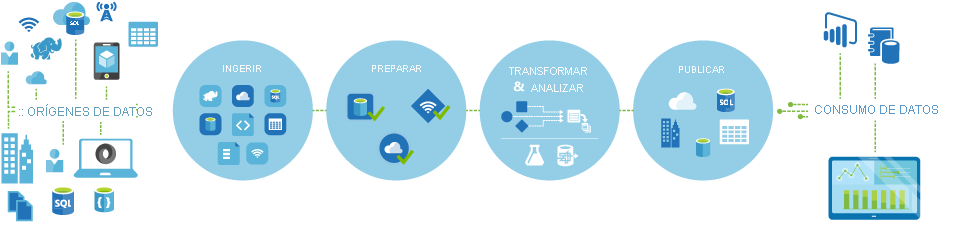

**Conectar y recopilar**
- Es el primer paso para crear un sistema de orquestación
- Definir y conectar todas las fuentes de datos necesarias
- Ingerir los datos según sea necesario

**Transformar y enriquecer**
- Usando los servicios de proceso (Databricks,Machine Learning, etc.) se preparan o generan datos transformados según una programación controlada y supervisada.

**Publicar**
- Una vez los datos estén perfeccionados y en un formato compatible listo para los negocios, se cargan en un almacenamiento de datos (SQL Database, Cosmos DB u otros análisis de motor con sus herramientas de inteligencia empresarial).

**Supervisión**
- **Azure Data Factory** está integrado con la supervisión de canalizaciones a través de API y registros de Azure Monitor, PowerShell y paneles en Azure Portal.
#### **Conocer los componentes de Azure Data Factory**
- Una suscripción puede tener varias instancias de Azure Data Factory
- Componentes:
  - **Linked Service**: Similares a cadenas de conexión que definen el acceso a recursos externos. Ejemplo: Data Lake Storage o Databricks
  - **Datasets**: Vista de datos con nombres que apunta o hace referencia a los datos dentro de un **Linked Service**.
  - **Activities**: Los **datasets** son movidos hacia un servidor donde se aplican las actividades. Con las actividades se pueden crear acciones en los datos, como copiarlos o usarlos en un proceso de recurso.
  - **Pipeline**: Es común tener muchas **Activities**, un grupo de estas juntas será conocido como **Pipeline**, permitiendo ser administradas en grupo
  - **Triggers y Parameters**: Al implementar y administrar la **pipeline**, puedes actualizar los componentes dinámicamente, así como los servicios vinculados en runtime, añadir parámetros.
  - **Integration Runtime**: Es la infraestructura de proceso que utiliza **Azure Data Factory**
  - **Control flow**: Se pueden gestionar el control de resultados durante la ejecución de actividades
> Si bien se mencionaron todos, los 4 primeros son los más importantes, pero si se entienden los demás, puede escoger la mejor solución que convenga.

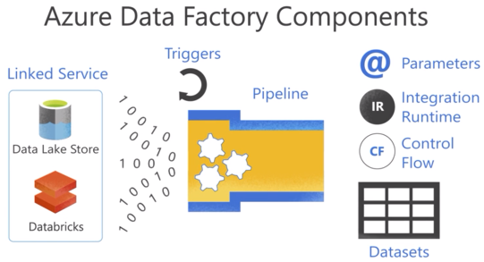

- Data Factory admite una variedad de orígenes de datos (+100)
- Los **Linked Services** pueden activar servicios de proceso a petición. (Cómo Databricks, conocido como *servicio vinculado de proceso*).
- Actividades contienen la lógica de transformación o los comandos de análisis del trabajo de ADF, o incluir **Data flow** para realizar transformaciones sin código. 
- También incluir ejecución de un store procedure, consulta Hive o Pig, etc.

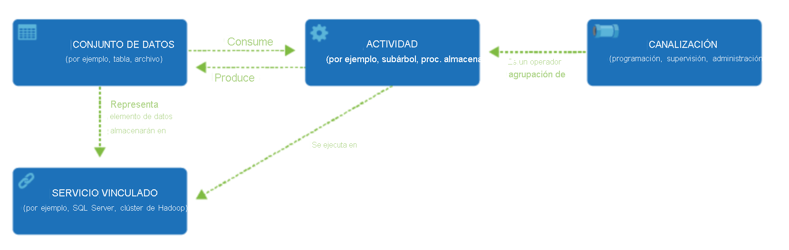

**Flujo de control**  
- Es una orquestación de actividades de canalización que incluye el encadenamiento de actividades en una secuencia, la bifurcación, la definición de parámetros en el nivel de canalización y el paso de argumentos mientras se invoca la canalización a petición o desde un desencadenador.
- También incluye el paso a un estado personalizado y contenedores de bucle, y los iteradores **"For each"**.
**Parámetros**
- Pares clave-valor de configuración de solo lectura.
- Se definen en la canalización y se pasan durante la ejecución desde el contexto creado por un desencadenador o ejecutado manualmente.
- *Las actividades dentro de la canalización* consumen los valores de parámetro
**Entorno de ejecución de integración**
- Integration Runtime
- Permite enlazar la actividad y los objetos de servicios vinculados.
- Tipo:
  - Azure
  - Autohospedado
  - Azure-SSIS
#### **Seguridad de Azure Data Factory**
- Para crear instancias de Data Factory, la cuenta de usuario debe ser un miembro de rol "Colaborador", "Propietario" o "Administrador".

**Rol de "Colaborador de Data Factory"**
- Crear, editar y eliminar Data Factory y recursos secundarios, incluidos datasets, linked services, pipelines, triggers y integration runtimes.
- Implementar plantillas de Resource Manager
- Administrar las alertas de App Insights para Data Factory
- Nivel de grupo de recursos o por encima de este, permite al usuario implementar plantillas de Resource Manager
- Crear incidencias de soporte técnico
> Puede crear su propio rol personalizado
#### **Configurar Azure Data Factory**
- Aprovisionar Azure Data Factory requiere de cierta información:
  - Nombre
  - Suscripción
  - Grupo de recursos
  - Versión: V2
  - Ubicación
  - Git (Opcional)

**Crear servicios vinculados**
```json
{
    "name": "<Name of the linked service>",
    "properties": {
        "type": "<Type of the linked service>",
        "typeProperties": {
              "<data store or compute-specific type properties>"
        },
        "connectVia": {
            "referenceName": "<name of Integration Runtime>",
            "type": "IntegrationRuntimeReference"
        }
    }
}
```
Propiedad|Descripción|Obligatorio
---|---|---
name|Nombre|Sí
type|Tipo de servicio vinculado (AzureStorage,AzureBacth por ejemplo)|Sí
typeProperties|Diferentes para cada almacén de datos o proceso. [Propiedades distintas](https://learn.microsoft.com/es-es/azure/data-factory/concepts-datasets-linked-services)|Sí
connectVia|Entorno Integration Runtime que se usará para conectarse al almacén de datos|No

#### **Creación de Datasets**
- Es una vista con nombre de los datos
- Apunta o hace referencia a los datos que usará en sus actividades como entrada y salidas.

```json
{
    "name": "<name of dataset>",
    "properties": {
        "type": "<type of dataset: AzureBlob, AzureSql etc...>",
        "linkedServiceName": {
                "referenceName": "<name of linked service>",
                "type": "LinkedServiceReference",
        },
        "schema": [
            {
                "name": "<Name of the column>",
                "type": "<Name of the type>"
            }
        ],
        "typeProperties": {
            "<type specific property>": "<value>",
            "<type specific property 2>": "<value 2>",
        }
    }
}
```

Propiedad|Descripción|Obligatorio
---|---|---
name|Nombre de Dataset|Sí
type|Tipo de dataset, admitido por Data Factory (AzureBlob,AzureSqlTable)|Sí
Schema|Esquema del dataset|No
typeProperties|Diferentes para cada tipo|Sí
#### **Creación de actividades y canalizaciones de factoría de datos**
Categorías:
- Actividades de movimientos de datos
- Actividades de transformación de datos
- Actividades de control

**Actividades de movimientos de datos**
- Mueven datos de un almacén de datos a otro
**Actividades de transformación de datos**
- Pueden realizarse de forma nativa en la herramienta de creación de Azure Data Factory mediante el flujo de datos de asignación
- Como alternativa, puede llamar a un recurso de proceso
- Puede usar cualquier paquete de SQL Server Integration Services existente almacenado en un catálogo para ejecutarse en Azure
**Actividades de control**
- Al crearse de forma gráfica las soluciones ADF, puede usarse el flujo de control en el diseño para orquestar las actividades de canalización que incluyen:
  - encadenamiento en una secuencia
  - bifurcación
  - definición de parámetros en el nivel de canalización
  - paso de argumentos al invocar la canalización a petición o desde un desencadenador
Funcionalidades actuales incluyen:

Actividad de control|Descripción
---|---
Actividad de ejecución de canalización|Permite que una canalización invoque otra canalización
Actividad ForEach|Flujo de control repetido en la canalización. Usa para iterar una colección y ejecuta las actividades especificadas en un bucle.
Actividad Web|Usada para llamar a un punto de conexión REST personalizado desde una canalización.
Actividad de búsqueda|Leer o buscar un registro, nombre de tabla o un valor de cualquier origen externo. Las actividades posteriores pueden hacer referencia a esta salida
Actividad de obtención de metadatos|GetMetadata se usa para recuperar metadatos de cualquier dato en ADF.
Actividad Until|Bucle Do-Until. Ejecuta conjunto de actividades en un bucle hasta que la condición asociada a la actividad la evalúa como "true". Puede especificar un valor de tiempo de espera para la actividad Until en Data Factory
Actividad If Condition|Usarse para crear una rama basada en una condición que evalua *true* o *false*.
Actividad Wait|Espera un período de tiempo específicado antes de continuar con la ejecución de actividades sucesivas
#### **Administración de entornos de ejecución de integración**
- Un entorno de ejecución de integración proporciona la infraestructura para la actividad y los servicios vinculados.
- Proporciona las siguientes funcionalidades de integración de datos en distintos entornos de red, entre los que se incluyen:
  - Data Flow
  - Movimiento de datos
  - Distribución de actividades
  - Ejecución de paquetes SSIS
> Cada que se crea una instancia de ADF, se crea un entorno de Integration Runtime predeterminado que admite operaciones en almacenes de datos en la nube y servicios de proceso en la red pública.
**Tipos de instancias de Integration Runtime**
Tipo de IR|Red pública|Red privada
---|---|---
Azure|Envío de actividad de movimientos de datos de flujo de datos|
Autohospedado|Envío de actividad de movimiento de datos|Envío de actividad de movimiento de datos
SSIS de Azure|Ejecución de paquetes SSIS|Ejecución de paquetes SSIS
### **Ingesta a escala de petabytes con Azure Data Factory o una canalización de Azure Synapse**

#### **Enumeración de los métodos de ingesta de Azure Data Factory**
##### **Ingesta de datos mediante la actividad de copia**
- Compilar canalizaciones de ingesta de datos sin código que no requieran ninguna transformación durante la extracción de los datos.
##### **Ingesta de datos mediante recursos de procesos**
- ADF llama a recursos de procesos para que los datos se procesen en estos de forma más adecuada.
Entorno de proceso|Actividades
---|---
Clúster de Azure HDInsight a petición o propio|
Azure Batch|
Azure Machine Learning Studio - Machine|Ejecución de batch y recurso de actualización
Azure Machine Learning|Ejecución de canalización de Azure Machine Learning
Análisis con Azure Data Lake|U-SQL de análisis con Data Lake
Azure SQL, Azure SQL Data Warehouse, SQL Server|Procedimiento almacenado
Azure Databricks|Notebook, JAR, Python
Azure Functions|Azure Function´s Activity
##### **Ingestión de datos mediante paquetes SSIS**
- ADF permite migrar mediante "lift-and-shift" la carga de trabajo de SSIS existente creando una instancia de Azure-SSIS Integration Runtime para ejecutar paquetes SSIS de forma nativa, y le permitirá implementar y administrar los paquetes SSIS existentes mediante herramientas como SQL Server Data Tools (SSDT) y SQL Server Management Studio (SSMS)

#### **Descripción de los conectores de Azure Data Factory**
- Conectores son objetos de ADF
- Conectores permiten que Linked Services y Dataset se conecten a una gran variedad de orígenes y receptores de datos
- Hay casi 100 conectores disponibles, hacia Azure como de terceros
- Muchos de estos funcionan con las actividades de copia, flujo de datos, búsqueda, obtención de metadatos y eliminación que se encuentran en ADF

**Entre los formatos de archivos admitidos tenemos**:
- Avro
- Binario
- Texto limitado por caracteres (CSV,TSV)
- JSON
- ORC
- Parquet

**Categorías de almacenes de datos**
- Azure: Data Lake Store, Synapse Analytics
- Bases de datos: Netezza, Greenplyum
- Almacenes NoSQL: Cassandra, MongoDB
- Archivos: FTP, Google Cloud Storage
- Protocolos genéricos: REST, ODBC
- Servicios y aplicaciones: Dynamics, Salesforce
#### **Comprensión de las consideraciones de seguridad de la ingesta de datos**
- Integración de datos requiere tratamiento seguro de datos, tanto en reposo como en tránsito.
##### **Red**
- **Uso de redes virtuales para proteger los recursos de Azure**:
  - Permiten comunicación segura entre servicios de Azure y servidores de red local
  - Red virtual es el bloque para configurar red privada
  - Implementar un entorno de ejecución de integración autohospedado en un servidor dentro de una red virtual
  - Para restringir acceso: configurar un grupo de seguridad de red (NSG)
- **Uso de los servicios para detectar y evitar intrusiones**
  - Denegar comunicación con dirección IP conocidas
  - Habilitar el estándar de protección contra denegación de servicio distribuido (DDoS) en la red donde se hospeda el entorno de ejecución de integración
  - Usar Azure Security Center
  - Usar Azure Firewall
  - Detección y/o prevención de intrusiones basada en la inspección de carga, puede redirigir el tráfico a un dispositivo de firewall mediante tunelización forzada de Azure ExpressRoute.
- **Simplificación de la administración de las reglas de seguridad mediante etiquetas de servicio de red**
  - Etiquetas de servicio permiten agrupar prefijos de dirección IP de un servicio de Azure determinado con fines administrativos.
  - Puede crear reglas de seguridad de red en grupos de seguridad de red basados en etiquetas de servicio
###### **Control de identidades y acceso**
- **Cuentas administrativas**
  - Trabajan y administran ADF
  - La cuenta de usuario que cree Data Factory debe ser rol colaborador o propietario, o ser administrador de la suscripción de Azure.
- **Uso de Active Directory para utilizar el inicio de sesión único**
  - Registrar las entidades de servicio en Azure AD para aprovechar la adminsitración de tokens de modo que el servicio ADF optimice su autenticación en todos los recursos de Azure.
##### **Protección de los datos**
- **Uso del control de acceso basado en roles (RBAC) para controlar el acceso a los recursos**
- **Información confidencial**
  - Serie de aspectos a tener en cuenta al trabajar con datos confidenciales:
    - Mantener lista de almacenes que contienen información confidencial.
    - Aislar los sistemas que almacenan o procesan información confidencial
    - Supervisión y bloqueo de una transferencia no autorizada de información confidencial
    - Cifrar toda la información confidencial que pasa en tránsito y en reposo.
##### **Registro y supervisión**
- **Configuración de la administración central de registros de seguridad**
  - Uso de Azure Monitor para centralizar almacenamiento de registros de ingesta que genera ADF, y realizar consultas mediante Log Analytics
  - Configurar una estrategia para almacenar registros a largo plazo en cuentas de Azure Storage
- **Supervisión y registro de la configuración y el tráfico de paquetes de red de redes virtuales, subredes y NIC**
  - Habilitar los registros de flujo de grupo de seguridad de red (NSG) para el NSG que protege la implementación de Integration Runtime, y envíe registros a una cuenta de Azure Storage para la auditoría del tráfico.
- **Habilitación del registro de auditoría**
  - Configuración de diagnóstico de ADF para configurar los registros de diagnóstico para realizar seguimiento de los datos de ejecución de canalización (Se conservan 45 días).
- **Habilitación de alertas en las actividades**
  - La configuración de diagnóstico para ADF que envía registros a Log Analytics, puede tener alertas configuradas para varias condiciones.
- **Siga el estándar de registro y supervisión estándar de la organización.**
  - Ajustar al estándar de organización para registro, supervisión y ajústese al estándar, incluido: 
    - Registro de auditoría
    - Registros de seguridad
    - Registro antimalware
    - Directivas de retención de registros
### **Realización de transformaciones sin código a escala con Azure Data Factory o una canalización de Azure Synapse**
- Puede elegir un método que coincida con el conjunto de aptitudes del equipo
- O aproveche tecnologías existentes que ya tiene en sus datos
- Realizar transformaciones sin escribir código mediante flujo de datos de asignación
#### **Descripción de los métodos de transformación de Azure Data Factory**
- **Transformación de datos mediante el flujo de datos de asignación**
  - Variedad de transformaciones de datos visualmente sin código.
  - Se ejecutan en clústeres de Apache Spark aprovisionados automáticamente
  - Proporcionan capacidad de supervisar la ejecución de transformaciones para ver progreso o comprensión de errores
- **Transformación de datos mediante recursos de procesos**
- **Transformación de datos mediante paquetes de SQL Server Integration Services (SSIS)**
  - Migrar mediante lift-and-shift la carga de trabajo de SSIS existente creando una instancia de Azure-SSIS Integration Runtime
#### **Descripción de los tipos de transformaciones de Azure Data Factory**
Proporcionan varios tipos diferentes de transformaciones que le permiten modificar los datos. Categorías:
Categoría|Descripción
---|---
Modificador de esquema|Crean nuevas columnas basadas en la acción de la transformación en el destino
Modificador de fila|Afecta la forma en que se presentan las filas en el destino. Ejm. Ordenar datos
Varias entradas/salidas|Generarán nuevas canalizaciones de datos o combinarán varias canalizaciones en una sola. Ejm: Unión, combina varios flujos de datos

Lista de transformaciones disponibles en los flujos de datos de asignación:

Nombre|Categoría|Descripción
---|---|---
Agregada|Esquema|SUM, MIN, MAX, COUNT, agrupadas por columnas calculadas o existentes
Alteración de fila|Fila|Inserción, eliminación, actualización y upsert en filas. Puede agregar condiciones
División condicional|Varias E/S|enruta filas de datos a diferentes flujos según condiciones
Col. derivada|Esquema|Genera nueva columna o modifica campos existentes
Exist|Varias E/S|Comprueba si existe en otro origen o flujo
Filter|Fila|Por una condición
Flatten|Esquema|Valor de matriz, como JSON y lo expande en filas individuales
Join|Varias ES|Combina datos de 2 o más origenes
Lookup|Varias ES|Hace referencia a los datos de otro origen
Nueva rama|Varias ES|Une a un conjunto de operaciones y transformaciones en el mismo flujo
Dinamización|Esquema|Valores de fila distintivos se transforman en columnas individuales
Select|Esquema|Alias de nombres de col, y flujos, y quita o reordena columnas
Sink|-|Destino final para datos
Sort|Fila|Ordena
Origen|-|Origen de datos
Clave suplente|Esquema|Agrega valor de clave en incremento
Unión|Varias ES|Combina varios flujos de datos verticalmente
Anulación de dinamización|Esquema|Dinamiza columnas en valores de fila
Ventana|Esquema|Agregaciones basadas en ventanas de las columnas

- **Generador de expresiones de flujo de datos**
Algunas transformaciones que puede definir tienen un generador de expresiones de flujo de datos, para personalizar la funcionalidad de una transformación mediante **columnas, campos, variables, parámetros y funciones del flujo de datos**.

QUEDA PENDIENTE!
QUEDA PENDIENTE!
QUEDA PENDIENTE!
QUEDA PENDIENTE!
QUEDA PENDIENTE!
QUEDA PENDIENTE!
QUEDA PENDIENTE!
QUEDA PENDIENTE!

### **Relleno de dimensiones de variación lenta en canalizaciones de Azure Synapse Analytics**
##### **Describir las dimensiones de variación lenta (SCD)**
Una SCD es la que administra correctamente el cambio de los miembros de la dimensión en el tiempo
- Se aplica cuando los valores de una entidad empresarial cambian con el tiempo, y no según una programación establecida.
**Ejemplo**:
  -  Dimensión Cliente - Columnas correo electrónico y teléfono, varian con el tiempo y no es habitualmente rápido, sino lento
> Otras dimensiones se consideran de variación rápida, como precio de mercado de un artículo.
El enfoque de diseño común:
  - Almacenar valores de atributo de variación rápida en una medida de tabla de hechos.
  - Para las SCD, los miembros que cambian deben permanecer en la tabla de dimensiones
  - Ejemplo: Columnas que pueden cambiar (1), y Columnas que realizan seguimiento (2) 


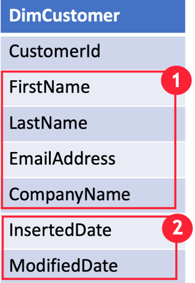

**Identificar si la dimensión será una SCD**
- ¿Permitirá actualizaciones en los registros?. Si es sí, se agregan campos de fecha adicionales a la tabla para realizar seguimiento de cuándo se han actualizado los datos.

#### **Elegir entre tipos de dimensión de variación lenta**
- Teoría de diseño de esquema de estrella hace referencia a tipos de SCD comunes
##### **SCD de tipo 1**
- Siempre refleja valores más recientes
- Se apoya de campos fecha

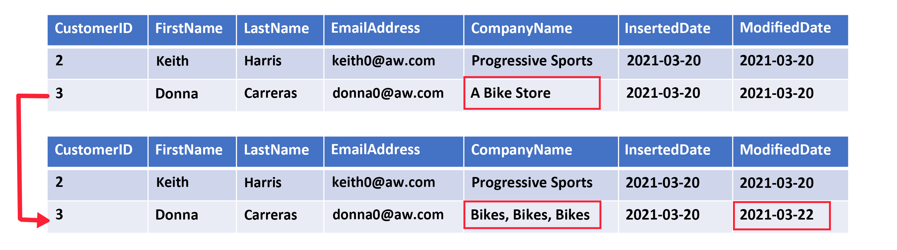

##### **SCD de tipo 2**
- Admite control de versiones de los miembros de la dimensión
- El sistema de origen no almacena versiones, por lo que el proceso de carga del almacen de datos detecta y administra los cambios en la tabla de dimensiones.
- En este caso, la tabla de dimensiones debe usar una clave suplente para proporcionar una referencia única a una versión del miembro de la dimensión.
- Se apoya de campos de fecha para definir la validez temporal y una columna de marca: True,False

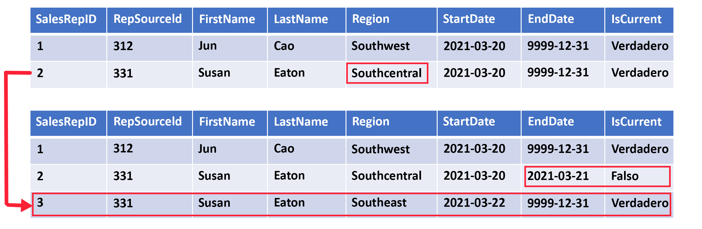

##### **SCD de tipo 3**
- Almacenamiento de dos versiones de un miembro de dimensión como columnas independientes.

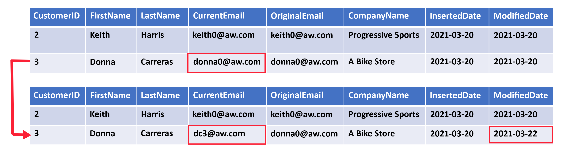

##### **SCD de tipo 6**
- Combina los tipos 1,2 y 3.

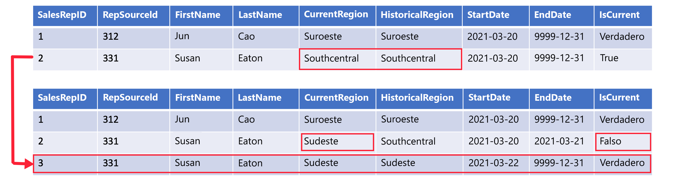

### **Orqueste el movimiento y la transformación de datos en Azure Data Factory o en las canalizaciones de Azure Synapse**
##### **Descripción del flujo de control de Data Factory**
- Flujo de control: Orquestación de actividades de canalizaciones, incluye encadenamiento de actividades en una secuencia, bifurcación, definición de parámetros en el nivel de canalización, paso de argumentos a petición o desde un desencadenador.
- Puede incluir contenedores de bucle

**Encadenamiento de actividades**
- En ADF se puede encadenar actividades en una secuencia dentro de una pipeline. 
- Existe propiedad *dependsOn* para encadenar una actividad a otra
**Actividades de bifurcación**
- Creación de ramas dentro de una pipeline: *If-condition*
**Parámetros**  
**Paso a estado personalizado**
- Actividad que creó la salida o el estado de la actividad que necesita consumir una actividad posterior de la canalización
- Ejemplo: definición JSON de una actividad, puede acceder a la salida de la actividad anterior.
**Contenedores de bucle**
- Iterar en una colección y ejecutar actividades especificadas en el bucle.
**Flujos basados en el desencadenador**
- Pipelines desencadenadas a petición(en función de eventos, Ejm. publicación de blob) o en tiempo de reloj.
**Invocación de una canalización desde otra**  
**Flujos delta**
- Los casos de uso relacionados son *cargas delta*
- Cargas delta en patrones ETL solo cargarán los datos que se han modificado desde una iteración anterior de una canalización. 
- Funcionalidades como actividad de búsqueda, programación flexible ayudan a controlar los trabajos de cargas delta.
**Otros flujos de control**
  - Actividad web: llamar a punto de conexión REST desde una pipeline de DF.
  - Actividad de obtención de metadatos: Recupera metadatos de cualquier dato de ADF

#### **Uso de canalizaciones de Data Factory**
- Canalización o Pipeline: Agrupación lógica de actividades donde las actividades juntas realizan una determinada tarea 
- Actividades de una canalización se conocen como *acciones*.
- Una actividad puede tomar datasets o ninguno, y generar uno o varios datasets.
- Una actividad que depende de una o varias actividades anteriores puede tener distintas condiciones de dependencia:
  - Correcto
  - Con error
  - Omitido
  - Completado
Ejemplo:
- Actividad A, seguida de Actividad B. Actividad B depende de A con el estado "Succeeded".
- Si tiene varias actividades en una canalización y las actividades siguientes no son dependientes de actividad anteriores, **las actividades se pueden ejecutar en paralelo**.

#### **Depurar canalizaciones de Data Factory**
- Neceisdad de los usuarios de desarrollar y depurar flujos de trabajo de ETL y ELT de forma iterativa
- Procedimiento recomendado: usar carpetas de prueba en las actividades de copia y otras actividades al depurar.
- Activas característica *Data Flow Debug* (Depuración de flujo de datos)
**Configuración de depuración**
- Cada sesión de depuración se considera una sesión nueva con su propio clúster de Spark
- Se puede especificar los valores (Parámetros) que se van a usar durante la depuración
- Se puede usar un punto de interrupción (hasta donde quiera probar)

#### **Incorporación de parámetros a los componentes de Data Factory**
**Parametrización de servicios vinculados en Azure Data Factory**
- Parametrizar un Linked Service por el que se pasan valores dinámicos en tiempo de ejecución.
**Parámetros globales en ADF**
- A nivel de instancia de ADF, cada canalizaciones pueden usar estos parámetros
**Parámetros globales en CI/CD**
- Incluirlos en la plantilla de ARM
- Implementar mediante un script de PowerShell

### **Ejecución de paquetes SSIS existentes en la canalización de Azure Data Factory o Azure Synapse**
#### **Descripción de SQL Server Integration Services**
- SSIS es un componente de SQL Server y consta de un servicio de Windows que administra la ejecución de flujos de trabajo de ETL.
- Usado para canalizaciones de integración de datos en local y entre diferentes sistemas.
- Una solución de SSIS normalmente consta de uno o varios proyectos de SSIS que contienen uno o más paquetes SSIS.

CONTINUAR!!!
### **Puesta en marcha de canalizaciones de Azure Data Factory o Azure Synapse**
#### **Sobre la compatibilidad con lenguajes en Azure Data Factory**

## **Obtención de soluciones analíticas integradas con Azure Synapse Analytics**
### **Introducción a Azure Synapse Analytics**
- Técnicas analíticas que las organizaciones suelen usar:
  - Análisis descriptivo:¿Qué está?
  - Análisis de diagnóstico:¿Por qué?
  - Análisis predictivo:¿Qué sucederá?
  - Análisis prescriptivo:Toma de decisiones en función de datos en tiempo real.

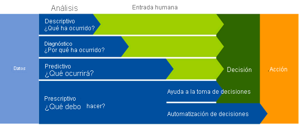

#### **Cómo funciona Azure Synapse Analytics**
- Combina servicio centralizado el almacenamiento y procesamiento de datos con una arquitectura extensible
- Esta arquitectura permite integrar almacenes, plataformas de procesamiento y herramientas de visualización mediante servicios vinculados.

**Área de trabajo de Azure Synapse Analytics**
- Es una instancia del servicio Synapse Analytics

**Trabajo con archivos en un lago de datos**
- Es un recurso principal del área de trabajo. Tiene uno predeterminado como servicio vinculado
- Se pueden agregar más servicios vinculados para varios lagos de datos.

**Ingesta y transformación de datos con canalizaciones**
- Compatibilidad integrada para adminsitrar canalizaciones.
- Misma tecnología que Azure Data Factory. Synapse se basa en esta última

**Consulta y manipulación de datos con SQL**
- Admite consultas por SQL :
  - En un grupo sin servidor para consultar datos basados en archivos en un lago de datos
  - Grupos de SQL dedicados que hospedan almacenes de datos relacionales.

En general:
- Grupo SQL sin servidor para análisis y procesamiento rentable de datos de archivo en el lago de datos
- Grupo SQL dedicados para crear almacenes de datos relacionales para el modelado e informes de datos empresariales.

**Procesamiento y análisis de datos con Apache Spark**
- Puede crearse grupos de Spark y usar notebooks.

**Exploración de datos con el Explorador de datos**
- Motor de proceasmiento de datos que se basa en Azure Data Explorer.
- Uso del lenguaje de consulta Kusto (KQL) para habilitar análisis de alto rendimiento y baja latencia de los datos por lotes y de streaming. 

**Integración con otros servicios de datos de Azure**
- Azure Synapse Link: Sincronización casi en tiempo real entre Azure CosmosDB, SQL Database, SQL Server, Power Platform Dataverse y el almacenamiento de datos de Synapse Analytics
- Microsoft Power BI
- Microsoft Purview
- Azure Machine Learning
#### **Cuándo usar Azure Synapse Analytics**
- Almacenamiento de datos a gran escala
- Análisis avanzado (predictivo con Azure Synapse y Azure Machine Learning)
- Exploración y detección de datos (SQL serverless)
- Análisis en tiempo real (Azure Synapse Link, Azure Stream Analytics y Azure Data Explorer)
- Integración de datos (Canalizaciones de Synapse Analytics)
- Análisis integrado
### **Uso de un grupo de SQL sin servidor de Azure Synapse Para consultar archivos en un lago de datos**
- Azure Synapse SQL es un sistema de consultas distribuido
  - Grupo de SQL sin servidor: Procesa consultas SQL bajo demanda
  - Grupo de SQL dedicado: Instancias de bases de datos relacionales a escala de Enterprise que se usan para hospedar almacenes de datos en los que los datos se almacenan en tablas relacionales.

**Grupo de SQL sin servidor**
- Usa Transact-SQL
- Conectividad integrada con herramientas de inteligencia empresarial y consulta ad hoc
- Consultas distribuidas
- Tolerancia a errores
- Serverless
- No se cobra por los recursos reservados, solo por los datos procesados por las consultas que ejecute.

**Casos de uso habituales**
- Exploración de datos
- Transformación de datos
- Almacenamiento de datos lógico (objetos externos como tablas y vistas almacenados en los archivos del lago de datos)

#### **Consulta de archivos mediante un grupo de SQL sin servidor**
```sql
SELECT TOP 100 *
FROM OPENROWSET(
    BULK 'https://mydatalake.blob.core.windows.net/data/files/*.csv',
    FORMAT = 'csv') AS rows
```
> La función `OPENROWSET` incluye más parámetros: Esquema, opciones de formato adicionales para los archivos de texto delimitados

#### **Creación de objetos de base de datos externos**
**Creación de una base de datos**
```sql
CREATE DATABASE SalesDB
    COLLATE Latin1_General_100_BIN2_UTF8
```
**Creación de un orígen de datos externo**
```sql
CREATE EXTERNAL DATA SOURCE files
WITH (
    LOCATION = 'https://mydatalake.blob.core.windows.net/data/files/'
)
```
**Asignar credenciales a los objetos de bases de datos**
```sql
CREATE DATABASE SCOPED CREDENTIAL sqlcred
WITH
    IDENTITY='SHARED ACCESS SIGNATURE',  
    SECRET = 'sv=xxx...';
GO

CREATE EXTERNAL DATA SOURCE secureFiles
WITH (
    LOCATION = 'https://mydatalake.blob.core.windows.net/data/secureFiles/'
    CREDENTIAL = sqlcred
);
GO
```

> Un objeto DATASOURCE proporciona información de conexión a los archivos de una instancia de Data Lake Storage

### **Análisis de datos con Apache Spark en Azure Synapse Analytics**
#### **Qué es un grupo de Apache Spark en Azure Synapse Analytics**
- Grupos de Spark sin servidor
Ventajas:
  - Velocidad y eficacia
  - Facilidad de creación
  - Facilidad de uso
  - API de REST (supervisar y enviar trabajos)
  - Integración con IDE de terceros
  - Bibliotecas de Anaconda
  - Escalabilidad
### **Análisis de datos en un almacenamiento de datos relacional**
#### **Diseño de un esquema de almacenamiento de datos**
- Esquema optimizado para el modelado multidimensional
- Tablas de `dimensiones` y de `hechos`

##### **Tablas de dimensiones**
- Describe entidad empresarial (producto, persona, lugar, fecha)
- Contiene columnas para los atributos y para claves.
- Habitual, dos columnas de clave:
  - Clave suplente: Específica del almacenamiento de datos, a menudo un número entero incremental
  - Clave alternativa: Identifica la instancia en el sistema de origen transaccional, a menudo un código de producto o identificador de cliente.

- Existen también una tabla de dimension con un intervalo de agregación en el nivel de fecha
##### **Tablas de hechos**
- Almacenan detalles de observaciones o eventos. Ejm: Pedidos de ventas, existencias, tipos de cambio o temperaturas registradas.
- Contienen columnas de clave que hacen referencia a claves únicas en tablas de dimensiones

##### **Diseños de esquemas de almacenamiento de datos**
- En BD transaccionales, los datos se normalizan. **PERO** en un almacenamiento de datos, los datos se **DESNORMALIZAN** para reducir el número de combinaciones necesarias para consultar.
- Usan esquema de estrella.
- Una tabla de hechos está directamente relacionada con las tablas de dimensiones


- Cuando una entidad tiene un gran número de niveles de atributo jerárquicos o cuando algunos atributos se pueden compartir mediante varias dimensiones
- Se aplica cierta normalización a las tablas de dimensiones y crear un esquema copo de nieve


#### **Creación de tablas de almacenamiento de datos**
- Crear un grupo de SQL dedicado
- Este tiene un nivel de rendimiento entre DW100C y DW30000C. Determina el costo por hora del grupo cuando está en ejecución
- Definir la intercalación del grupo de SQL

**Características de grupos de SQL dedicados**
- No admiten restricciones únicas y de claves externos
- Admiten índices agrupados, pero es de tipo *almacén de columnas agrupado*
- Arquitectura MPP. Tipos de distribución de proceso: 
  - Hash: calcula un valor hash determinista para la columna específicada y se usa para asignar la fila a un nodo de proceso.
  - Round robin: filas se distribuyen uniformemente en todos los nodos de proceso
  - Replicado: copia de la tabla se almacena en cada nodo de proceso.

Según tipo de tabla se determina qué opción elegir:

Tipo de tabla|Opción de distribución
---|---
Dimensión|Replicada si son tablas pequeñas. Caso contrario hash
Hecho|Hash
Ensayo|Round robin para tablas de almacenamiento provisional

**Crear tablas de dimensiones**
```sql
CREATE TABLE dbo.DimCustomer
(
    CustomerKey INT IDENTITY NOT NULL,
    CustomerAlternateKey NVARCHAR(15) NULL,
    CustomerName NVARCHAR(80) NOT NULL,
    EmailAddress NVARCHAR(50) NULL,
    Phone NVARCHAR(25) NULL,
    StreetAddress NVARCHAR(100),
    City NVARCHAR(20),
    PostalCode NVARCHAR(10),
    CountryRegion NVARCHAR(20)
)
WITH
(
    DISTRIBUTION = REPLICATE,
    CLUSTERED COLUMNSTORE INDEX
);
```

**Uso de tablas externas**
- Si los datos que se van a cagar están en archivos con una estructura adecuada, creen tablas externas que hagan referencia a la ubicación del archivo.

#### **Cargas de tablas de almacenamiento de datos**
Patrón de carga:
- Transferir datos de los sistemas de origen a los archivos de un lago de datos
- Ingerir los datos de los archivos en tablas de almacenamiento provisional
- Usar instrucciones SQL para cargar los datos desde las tablas de almacenamiento privisional hasta las de dimensiones y hechos

Normalmente, la carga es un proceso periódico por lotes

**Carga de datos en tablas de almacenamiento provisional**
- Si se usa tablas externas no es necesario carga datos en almacenamiento provisional
- Caso contrario, se usa la instrucción COPY

**Carga de datos almacenados provisionalmente en tablas de dimensiones**
- Uso de CREATE TABLE AS (CTAS)
- Uso de INSERT

**Actualización de tablas de dimensiones**
- Controlar actualizaciones de datos de dimensión
- Ausmir las dimensiones que cambian lentamente (SCD)
Se implementan tres tipos de SCD:
  - Tipo 0: No se cambian los datos de dimensión.
  - Tipo 1: Cambio en fila de dimensión se aplica a todos los hechos cargados
  - Tipo 2: Un cambio en una dimensión, resulta en una nueva fila. Se conversan filas de versiones anteriores.

**Optimización posterior a la carga**
- Recompilar los índices de almacén de columnas de tabla y actualizar las estadísticas de las columnas consultadas habitualmente

- Recompilan todos los índices de la tabla DimProduct
```sql
ALTER INDEX ALL ON dbo.DimProduct REBUILD
```
- Crean estadísticas en la columna `ProductCategory` de la tabla `DimProduct`:
```sql
CREATE STATISTICS productcategory_stats
ON dbo.DimProduct (ProductCategory);
```

### **Análisis y optimización del almacenamiento de datos en Azure Synapse Analytics**
#### **Entender el uso de datos y espacios sesgados**
- Los datos se distribuyen de forma desigual entre los nodos
- Comprobar la asimetría de datos con:
```sql
-- Find data skew for a distributed table
DBCC PDW_SHOWSPACEUSED('dbo.FactInternetSales');
```
**Vistas de adminsitración dinámica (DMV) del sistema**
Nombre de la tabla|Descripción
---|---
sys.schemas|Todos los esquemas de la base de datos.
sys.tables|Todas las tablas de la base de datos.
sys.indexes|Todos los índices de la base de datos.
sys.columns|Todas las columnas de la base de datos.
sys.pdw_table_mappings|Asigna cada tabla a tablas locales en nodos físicos y distribuciones.
sys.pdw_nodes_tables|Contiene información sobre cada tabla local de cada distribución.
sys.pdw_table_distribution_properties|Contiene información de distribución para las tablas (el tipo de distribución que tienen las tablas).
sys.pdw_column_distribution_properties|Contiene información de distribución para las columnas. Filtrado para incluir solo las columnas usadas para distribuir sus tablas primarias (distribution_ordinal = 1).
sys.pdw_distributions|Contiene información sobre las distribuciones del grupo de SQL.
sys.dm_pdw_nodes|Contiene información sobre los nodos del grupo de SQL. Filtrado para incluir solo nodos de proceso (type = COMPUTE).
sys.dm_pdw_nodes_db_partition_stats|Devuelve información de página y recuento de filas de cada partición en la base de datos actual

## **Trabajo con almacenamientos de datos con Azure Synapse Analytics**
## **Realización de tareas de ingeniería de datos con grupos de Apache Spark en Azure Synapse**
## **Uso de soluciones de procesamiento analítico y transaccional híbridas mediante Azure Synapse Analytics**

## **Ingeniería de datos con Azure Databricks**
### **Explorar Azure Databricks**
- Plataforma distribuida basada en la nube para procesamiento de datos integrado con Apache Spark. 
- Se hospeda en Microsoft Azure y se integra con servicios de Azure como Azure AD, Storage, Synapse Analytics y Machine Learning
- Para usar Azure Databricks, debe crear un *área de trabajo*
#### **Identificación de las cargas de trabajo de Azure Databricks**
- Optimizado para tres tipos específicos de carga de trabajo de datos y roles de usuario asociados:
  - Ciencia de datos e ingeniería
  - Machine Learning
  - SQL (Solo premium)

**Ciencia de datos e ingeniería**
- Procesamiento y análisis basado en Apache Spark, a través de código en Python,Scala,SparkSQL y u otro.
**Machine Learning**
- AutoML para entrenar modelos predictivos
- Otros marcos: SparkML, Scikit-Learn, PyTorch, Tensorflow
- Administrar ciclo de vida de MLFlow.
**SQL (solo premium)**
- Admite consultas SQL para datos almacenados en tablas en un almacén SQL.

#### **Descripción de conceptos clave**
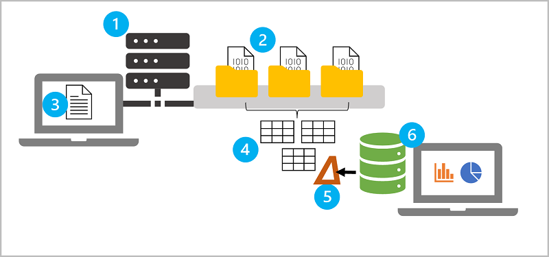

1. Clústeres de Apache Spark: Nodo controlador y nodo de trabajo.
2. Databricks File System (DBFS): Cada nodo de clúster tiene su propio sistema de archivo local, los nodos tienen acceso a un sistema de archivos compartido. DBFS permite montar almacenamiento en la nube y usarlo para trabajar con datos basados en archivos y conservarlos.
3. Notebooks
4. Metastore de Hive: Hive se usa para definir una capa de abstracción relacional de tablas sobre datos basados en archivos. Se crea un metastore de Hive para cada clúster cuando se crea el clúster. **Pero puede configurar un clúster para que use un metastore externo**
5. Delta Lake: Abstracción de esquemas de tabla relacional sobre archivos del lago de datos para agregar compatibilidad con la semántica de SQL. Incluye funcionalidades: registro de transacciones, restricciones de tipos de datos y capacidad de incorporar datos de streaming en una tabla relacional.
6. SQL Warehouses
### **Uso de Apache Spark en Azure Databricks**
- Inicia y administra clústeres de Apache Spark en su suscripción de Azure desde un alto nivel
- Controlador de Spark y Nodos de trabajo
- Los programas de controlador acceden a Apache Spark a través de un objeto *SparkSession*.
- Azure administra el clúster y le aplica escalabilidad automática, además de habilitarse la terminación automática.
  
**Trabajos de Spark en detalle**
- Trabajo enviado al clúster se divide en trabajos independientes a cada nodo
- Un trabajo independientes se subdivide en tareas.
- La entrada a un trabajo se divide en una o más particiones
- Puede que sea necesario reorganizar las particiones y compartirlas a través de red.

#### **Clúster de Spark en Azure Databricks**
- Modo de clúster:
  - Estándar: Cargas de trabajo de usuario único
  - Alta simultaneidad: Varios usuarios la usarán
  - Nodo único: Cargas pequeñas o pruebas. 1 nodo de trabajo.

**Administración de recursos de clúster de Azure**
- Al crear se implementa un *dispositivo de Databricks* como recurso
- Se implementa como grupo de recursos administrado en la suscripción
- Contiene las VM de controlador y de trabajo, red virtual, grupo de seguridad y una cuenta de almacenamiento
- Los metadatos para el clúster se almacenan en una BD de Azure.
- Kubernetes Service se usa para ejecutar los planos de datos.
- Plano de control de Azure Databricks a través de VM versión Dv3 con discos SSD NvMe de baja latencia.
- Spark se beneficia de este hardware

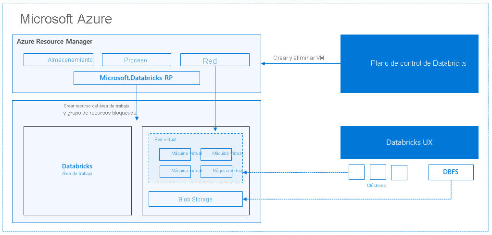

### **Uso de Delta Lake en Azure Databricks**
- Agrega semántica de base de datos relacional al procesamiento de lago de datos basado en Spark.
- Se admite en grupos de Spark de Synapse Analytics, en PySpark, Scala y .NET
- Ventajas:
  - **Tablas relacionales que admiten consultas y modificaciones de datos**:Puede usar CRUD en archivos, de la misma manera que se haría en una tabla de una BD relacional
  - **Compatibilidad con transacciones ACID**: Delta Lake aporta esta compatibilidad a Spark, mediante un registro de transacciones y la aplicación de aislamiento serializable
  - **Control de versiones de datos y viaje en el tiempo**: Como las transacciones están registradas, se puede realizar seguimiento de versiones de cada fila de tabla, e incluso recuperar una versión anterior de una fila en una consulta.
  - **Compatibilidad con datos por lotes y streaming**: Compatibilidad nativa con datos de streaming a través de API Spark Structured Streaming.
  - **Formatos estándar e interoperabilidad**: Formato Parquet

#### **Creación de tablas de Delta Lake**
- Se basa en tablas, que proporcionan abstracción de almacenamiento relacional
- Guardar una trama de datmos en formato *delta* y especificar una ruta de acceso donde se almacenarán los datos e información de metadatos relacionada a la tabla.

```python
# Load a file into a dataframe
df = spark.read.load('/data/mydata.csv', format='csv', header=True)

# Save the dataframe as a delta table
delta_table_path = "/delta/mydata"
df.write.format("delta").save(delta_table_path)
```
> Después de creado se guarda en archivo Parquet, y una carpeta *_delta_log* que contiene registro de transacciones de la tabla

**Realización de actualizaciones condicionales**
- A través de la Delta Lake API puede actualizar, eliminar, combinar, insertar.

#### **Creación y consulta de tablas de catálogo**
- Crear instancias de tablas de catálogo de Delta Lake en el metastore de Hive para el clúster de Spark y trabajar con ellas mediante SQL.
**Comparación de tablas *externas* y *administradas***
- Administrada: No se define una ubicación, y los archivos de datos se almacenan en el metastore. Al eliminar tabla, se elimina los datos.
- Externa:Se define una ubicaión donde se almacenan los datos. Los metadatos de la tabla se definen en el catálogo de Spark.
**Creación de tablas de catálogo**
- A partir de un dataframe
```python
# Save a dataframe as a managed table
df.write.format("delta").saveAsTable("MyManagedTable")

## specify a path option to save as an external table
df.write.format("delta").option("path", "/mydata").saveAsTable("MyExternalTable")
```

- Mediante SQL
```python
spark.sql("CREATE TABLE MyExternalTable USING DELTA LOCATION '/mydata'")
# OR CREATE TABLE IF NOT EXIST
# OR CREATE OR REPLACE TABLE
```
```sql
%sql

CREATE TABLE MyExternalTable
USING DELTA
LOCATION '/mydata'
```
- Definición de esque de tabla
```sql
%sql

CREATE TABLE ManagedSalesOrders
(
    Orderid INT NOT NULL,
    OrderDate TIMESTAMP NOT NULL,
    CustomerName STRING,
    SalesTotal FLOAT NOT NULL
)
USING DELTA
```
- Uso de DeltaTableBuilder API
```python
from delta.tables import *

DeltaTable.create(spark) \ #createIfNotExist or createOrReplace
  .tableName("default.ManagedProducts") \
  .addColumn("Productid", "INT") \
  .addColumn("ProductName", "STRING") \
  .addColumn("Category", "STRING") \
  .addColumn("Price", "FLOAT") \
  .execute()
```
- Uso de tablas de catálogo
```sql
%sql

SELECT orderid, salestotal
FROM ManagedSalesOrders
```
#### **Uso de Delta Lake para transmitir datos**
- Puede usar una tabla de Delta Lake como origen o receptor para Spark Structured Streaming
```python
from pyspark.sql.types import *
from pyspark.sql.functions import *

# Load a streaming dataframe from the Delta Table
stream_df = spark.readStream.format("delta") \
    .option("ignoreChanges", "true") \
    .load("/delta/internetorders")

# Now you can process the streaming data in the dataframe
# for example, show it:
stream_df.show()
```
> Cuando usa una tabla de Delta Lake como origen de streaming, solo se pueden realizar operaciones de anexión en el flujo. Las modificaciones de datos provocarán un error a menos que se especifique opción `ignoreChanges` o `ignoreDeletes`

**Uso de una tabla de Delta Lake como receptor de streaming**
- El flujo de entrada es un dataframe sin límites, que luego se escribe en formato delta en una ubicación de carpeta para una tabla de Delta Lake.
```python
from pyspark.sql.types import *
from pyspark.sql.functions import *

# Create a stream that reads JSON data from a folder
streamFolder = '/streamingdata/'
jsonSchema = StructType([
    StructField("device", StringType(), False),
    StructField("status", StringType(), False)
])
stream_df = spark.readStream.schema(jsonSchema).option("maxFilesPerTrigger", 1).json(inputPath)

# Write the stream to a delta table
table_path = '/delta/devicetable'
checkpoint_path = '/delta/checkpoint'
delta_stream = stream_df.writeStream.format("delta").option("checkpointLocation", checkpoint_path).start(table_path)
```
- Una vez iniciado el proceso de streaming, podemos consultar, previamente creamos una tabla de catálogo para la capreta de tabla de Delta Lake:

```sql
%sql

CREATE TABLE DeviceTable
USING DELTA
LOCATION '/delta/devicetable';

SELECT device, status
FROM DeviceTable;
```
- Para detener el flujo de datos que se escriben en la tabla de Delta Lake, puede usar método `stop`
```python
delta_stream.stop()
```

### **Uso de almacenes SQL en Azure Databricks**
- Conocidos como puntos de conexión de SQL
- Proporcionan una interfaz de base de datos relacional para los datos de Azure Databricks
- Los datos se almacenan en archivos abstraídos por tablas delta en un metastore de Hive.
#### **Creación de bases de datos y tablas**
- Instancias de SQL Warehouse contienen una BD predeterminada denomiada *default*.
- Para crear una nueva use:
```sql
CREATE SCHEMA salesdata; --OR CREATE DATABASE
```
**Tablas**
- Los datos importantes se almacenan en DBFS y se define una tabla Delta para ella en el metastore de Hive
- Crea una tabla denominada salesorders en la base de datos salesdata, basada en la carpeta /data/sales/ del almacenamiento DBFS.
```sql
CREATE TABLE salesdata.salesorders
(
    orderid INT,
    orderdate DATE,
    customerid INT,
    ordertotal DECIMAL
)
USING DELTA
LOCATION '/data/sales/';
```
#### **Creación de consultas y paneles**
- Paneles: mostrar resultados de consultas, ya sea como tablas o visualizaciones
- Puede crear visualizaciones y resultados de tablas en un panel para compartirlos

### **Ejecución de cuadernos de Azure Databricks con Azure Data Factory**
- Azure Data Factory contiene una actividad llamada "Notebook"
#### **Creación de un servicio vinculado para Azure Databricks**
- La canalización de ADF debe conectarse al área de trabajo, lo que requiere autenticación. Se debe realizar dos tareas de configuración
  - Generar un *token de acceso* para el área de trabajo de Azure Databricks
  - Crear un *servicio vinculado* en ADF que use el *token de acceso* para conectarse a Azure Databricks
##### **Generación de un token de acceso**
- Alternativa a las credenciales en forma de nombre de usuario y contraseña
- Tokens de acceso para aplicaciones, período de expiración 
- Opción "Generar nuevo token" en la pestaña "Tokens de acceso" de "Configuración de usuario"

#### **Uso de parámetros en un Notebook**
- Pasar valores de variable a un cuaderno desde una canalización
- Biblioteca dbutils.widgets
```python
# Define una variable  folder y asigna un valor
dbutils.widgets.text("folder", "data")
# Recuperar un valor de parámetro
folder = dbutils.widgets.get("folder")
```
> Función get recuperará el valor del parámetro específico. Si no se ha pasado este parámetro, obtendrá el valor predeterminado de la variable que declaró anteriormente.

**Pasar valores de salida**  
Además de usar parámetros que se pueden pasar a un cuaderno, puede pasar valores fuera de la aplicación que realiza la llamada mediante la función notebook.exit, como se muestra aquí:
```python
path = "dbfs:/{0}/products.csv".format(folder)
dbutils.notebook.exit(path)
```

## **Procesamiento de datos de gran escala con Azure Data Lake Storage Gen2**
### **Introducción a Azure Data Lake Storage**
- Repositorio de datos que se almacenan en su formato natural, normalmente como blobs o archivos.
- Basa en capacidades de Azure Blob Storage
**Ventajas**
- Afronta variedad y volumen de datos a escala de exabytes y administra cientos de gygabytes de resultados.
- Como base de soluciones en tiempo real y de lotes
  - Acceso compatible con Hadoop
  - Seguridad con listas de control de acceso ACL y permisos POSIX (Portable Operating System Interface)
  - Rendimiento: En jerarquía de directorios

#### **Comparación entre Azure Data Lake Storage y Azure Blob Storage**
Característica|Azure Blob Storage|Azure Data Lake Storage
---|---|---
Jerarquía|Espacio de nombres planos|Espacio de nombres jerárquicos.Optimizado para la E/S de datos. Los metadatos se almacenan sobre cada directorio y archivos que contienen.

#### **Descripción de las fases del procesamiento de macrodatos mediante Azure Data Lake Storage**
- Papel fundamental en una amplia gama de arquitecturas de macrodatos
  - Almacenamiento de datos moderno
  - Análisis avanzados con macrodatos
  - Solución de análisis en tiempo real
**Fases comunes**:
  - Ingesta
  - Almacenamiento
  - Preparación y entrenamiento
  - Modelado y entrega

##### **Examen de los usos de Azure Data Lake Storage Gen2**
###### **Creación de un almacenamiento de datos moderno**
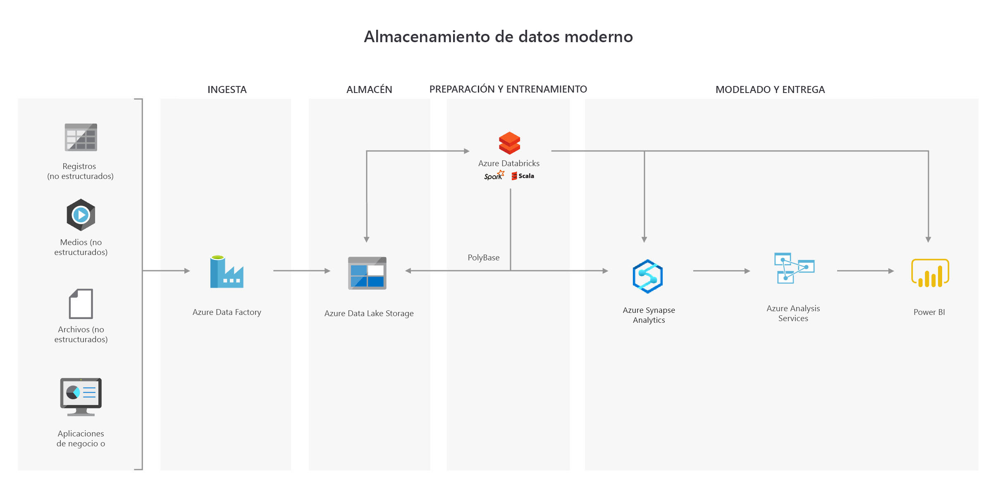

###### **Análisis avanzado para macrodatos**
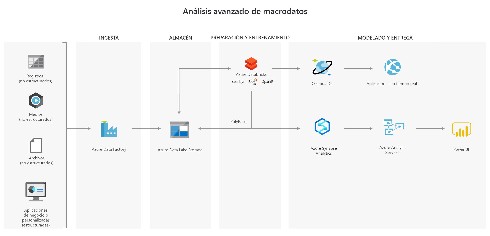

###### **Soluciones de análisis en tiempo real**
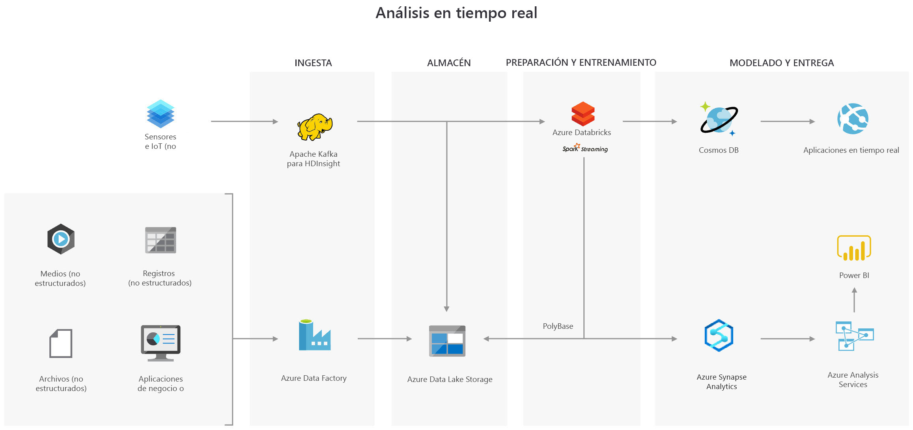

## **Implementación de una solución de streaming de datos con Azure Stream Analytics**
### **Introducción a Azure Stream Analytics**
- Objetivos:
  - Analizar continuamente los datos para notificar problemas o tendencías
  - Describir el comportamiento del componente o del sistema bajo varias condiciones para ayudar a planear futuras mejoras
  - Desencadenar acciones o alertas específicas cuando se producen determinados eventos o se superan ciertos umbrales

**Características de las soluciones de procesamiento de flujos**
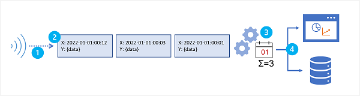

1. El flujo de datos de origen no está enlazado: los datos se agregan al flujo de forma perpetua.
2. Cada registro de datos del flujo incluye datos temporales (basados en el tiempo) que indican cuándo se ha producido el evento al que se relaciona el registro (o cuándo se ha registrado).
3. La agregación de datos de streaming se realiza mediante ventanas temporales; por ejemplo, registrando el número de publicaciones en redes sociales por minuto o la lluvia media registrada por hora.
4. Los resultados del procesamiento de datos de streaming se pueden usar para admitir la automatización o visualización en tiempo real (o casi en tiempo real), o bien se conservan en un almacén analítico a fin de combinarse con otros datos para el análisis histórico. Muchas soluciones combinan estos enfoques para admitir los análisis históricos y en tiempo real.

#### **Descripción del procesamiento de eventos**
- Azure Stream Analytics es un servicio para procesamiento de eventos complejos y análisis de datos de flujos. Se usa para:
  - Ingerir datos de una entrada como *Azure Event Hubs*, IoT Hub o un contenedor de Azure Storage
  - Procesar los datos con una consulta para seleccionar, proyectar o sumar valores de datos
  - Escribir los resultados en una salida , como Azure Data Lake Storage Gen2,Azure SQL Database, Azure Synapse Analytics,Azure Functions, Azure Events Hubs, Microsoft Power BI u otros.


Una vez iniciada, se ejecutará una consulta de Stream Analytics de forma perpetua para procesar nuevos datos a medida que llegan a la entrada y almacenar los resultados en la salida.

- Garantiza un procesamient de eventos y almenos una entrega de eventos, de modo que los datos nunca se pierden. 
- Presenta funcionalidades de recuperación integradas
- Puntos de comprobación integrados para mantener el estado del trabajo y produce resultados repetibles
- Es un PaaS
- El motor de Stream Analytics permite procesamiento en memoría

**Trabajos y clústeres de Azure Stream Analytics**
- Crear un trabajo de Stream Analytics
- Configurar entradas y salidas
- Definir conuslta que usará el trabajo para procesar datos
- La consulta se expresa mediante SQL y se puede proporcionar datos de referencia **estáticos** de varios origenes de datos
  
Si los requisitos del proceso son complejos o consumen muchos recursos, se crea un clúster de Stream Analytics, en un inquilino dedicado y con escalabilidad configurable.

### **Habilitación de mensajería confiable para aplicaciones de macrodatos con Azure Event Hubs**
#### **Creación de un centro de eventos mediante la CLI de Azure**
- Servicio de procesamiento de eventos basado en la nube capaz de recibir y procesar millones de eventos por segundo.
- Recibe los datos entrantes y almacena hasta que los recursos de procesamiento estén disponibles
- Quién envia datos a Event Hub se denomina publicador
- Quién lee datos desde un Event Hub se denomina suscriptor
**Eventos**
- Un evento es un pequeño paquete de información (un datagrama) que contienen una notificación.
- Los eventos se publican individualmente o en lotes
- Una sola publicación(individual o lote) no puede superar 1 MB

**Publicadores y suscriptores**
- Publicadores: enviar eventos mediante HTTPS,AMQP 1.0 o Apache Kafka.
  - Para enviar datos con frecuencia: AMQP tiene mejor rendimiento
  - Pero tiene mayor sobrecarga de sesión inicial
  - Para publicación más intermitente, es HTTPS, aunque requiere mas sobrecarga para cada solicitud.
  - Punto de conexión compatible con las API de productor y consumidor de Apache Kafka.

**Grupos de consumidores**
- Vista específica del flujo de datos de un Event Hub
- Varios suscriptores pueden procesar un flujo de eventos por separado sin afectar a otros mediante grupos de consumidores

**Precios**
- Básico, Estándar(20 grupos de consumidores, 1000 conexiones asincrónicas), Premium y Dedicado
- Difiere en:
  - Conexiones admitidad
  - Número de grupos de consumidores disponibles
  - Rendimiento

##### **Creación y configuración de un centro de eventos**
- Definir un espacio de nombres para Event Hubs (Es un contenedor para administrar uno o varios Event Hubs)
**Definir la configuración en el nivel de espacio de nombres de Event Hubs**
- (Similar a una cuenta de almacenamiento de Azure Storage)
- El plan de tarifa, métricas de rendimiento se definen en el nivel de espacio de nombres
- La capacidad que se configura mediante *unidades de procesamiento*
- Esos valores se aplican a todos los Event Hubs dentro de ese espacio de nombres.
- El valor predeterminado: 1 para la capacidad y Estándar para el plan de tarifa

**Consideraciones**
- Crar distintos espacios de nombres, dónde una sea de alto rendimiento, y otros poco frecuentes con un plan estándar.
**Configuraciones adicionales del espacio de nombres**
- Espacio de nombres sea redundante
- Escalado vertical y horizontal automático de las unidades de procesamiento

**Configuración de un nuevo centro de eventos**
- Después de creado espacio de nombre para Event Hubs, puede crear Event Hubs dentro.
  - Número de particiones: (2-32 nivel estándar). Relacionado con el número previsto de consumidores simultáneos. La partición separa el flujo de mensajes. Valor predeterminado es 4.
  - Retención de mensajes: Seguirán disponibles
  - Es posible configurar un Event Hub para que transmita datos a Azure Data Lake Storage o Azure Blob Storage

#### **Configurar aplicaciones para enviar o recibir mensajes mediante un centro de eventos**
- Debe configurar aplicaciones para enviar y recibir flujos de datos de eventos
**Aplicación que envia mensajes a un Event Hub**
- Nombre de Espacio de nombres de Event Hub
- Nombre de Event Hub
- Nombre de la directiva de acceso compartido
- Clave principal de acceso compartido

**Aplicación que recibe mensajes de un Event Hub**
- Nombre de Espacio de nombres de Event Hub
- Nombre de Event Hub
- Nombre de la directiva de acceso compartido
- Clave principal de acceso compartido
(Opcional)
- El nombre de la cuenta de almacenamiento
- La cadena de conexión de la cuenta de almacenamiento
- El nombre del contenedor de la cuenta de almacenamiento

#### **Evaluació del rendimiento del centro de eventos implementado mediante Azure Portal**
- Se debe supervisar para asegurarse de que funciona según lo esperado
**¿Cómo puedo probar la resistencia de Event Hub?**
- Solicitudes limitadas
- ActiveConnections
- Bytes entrates/salientes
### **Ingesta de flujos de datos con Azure Stream Analytics**
#### **Procesamiento de flujos**
- Referencia a la ingesta, transformación y el análisis continuo de flujos de datos generados por aplicaciones, dispositivos y sensores de IoT para derivar información procesable casi en tiempo real.
- Implica uso de operaciones temporales como agregados con ventanas, combinaciones temporales y funciones analíticas temporales para medir los cambios o las diferencias a lo largo del tiempo.

**Intención**
- Supervisar continuamente los datos mediante ventanas de duración fija, para ver como cambian con el tiempo
- Identificar anomalías e irregularidades y reaccionar en tiempo real.
- Analizar permanentemente nuevos datos para identificar problemas y responder
- Desencadenar acciones específicas cuando se identifican determinados umbrales.

**Enfoque**
- Analizar continuamente datos
- Transformar los datos entrantes
- Cálculos y agregaciones ejecutarse en datos
- Enviar a un panel de Power BI para visualización en tiempo real
- Implica conversar los datos en ADLS Gen2, para un examen exhaustivo posterior u otras cargas de trabajo de análisi más avanzados.

#### **Procesamiento de datos de streaming con Azure Stream Analytics**
- Es el servicio recomendado para el análisis de flujos en Azure.
- Puede ingerir, procesar y analizar datos de streaming de Azure Event Hubs, Azure IoT Hub y Azure Blob Storage.
**Escenarios**:
- Paneles de visualización de datos
- Alertas en tiempo real de patrones espaciales y temporales o anomalías
- Extraer, transformar y cargar (ETL)
- Patrón Event Sourcing
- IoT Edge

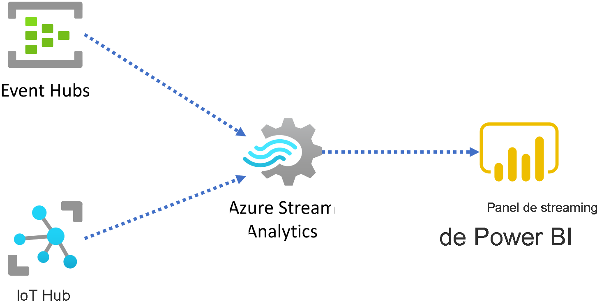

Funcionalidades listas:
- Operadores temporales integrados
- Adaptadores de entrada y salida nativos de Azure
- Compatibilidad con datos de referencia de variación lenta(tablas de búsqueda)
- Datos de regerencia geoespaciales de geovalla
- Detección de anomalías (Es una solución integrada)
- Varias ventanas de tiempo en la misma consulta
- Crear varios operadores temporales en sencuencias arbitrarias

**Aspectos operativos**
- PaaS
- Garantiza costos de inicio bajo (3 Unidades de Streaming de forma predeterminada)
- Trabajo escalable hasta 192 unidades de streaming
- Las unidades de streaming (SU) representan recursos informáticos designados.
- Aumentar mas SU supone asignar más recursos de CPU y memoría
- Todo el procesamiento es en memoría

#### **Descripción de las funciones de ventana**
- Operaciones realizadas en los datos contenidos dentro de una ventana temporal o de una duración fija.
- Una venta contiene datos de eventos a lo largo de una escala de tiempo

Ejemplo: Contar el núero de veces que se produce un evento durante un período determinado.

Azure Stream Analytics incluye compatibilidad nativa con cinco tipos de funciones de ventanas temporales:
- Saltos de tamaño constante
- Salto
- Deslizante
- Sesión
- Instantánea

##### **Saltos de tamaño constante**
- Segmentan un flujo de datos en una serie contigua de segmentos temporales de tamaño fijo y no superpuestos.
- Los eventos solo pertenecen a una ventana de saltos de tamaño constante

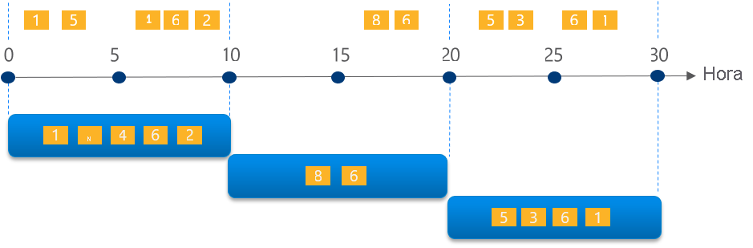

```sql
SELECT EventName, COUNT(*) AS Count
FROM EventStream TIMESTAMP BY EventTimestamp
GROUP BY EventName, TumblingWindow(minute, 10)
```
- Las ventanas son del tipo `InicioVentana < Hora <= FinVentana`
> TumblingWindow() especifca un tamaño de venta de 10 minutos
##### **Salto**
- Ventanas superpuestas programadas
- Los eventos pueden pertenecer a más de un conjunto de resultados de ventana

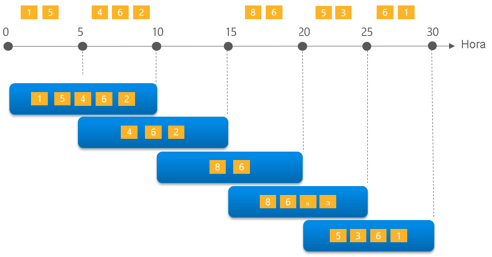


```sql
-- Count the number of times each event occurs every 10 seconds
SELECT EventName, COUNT(*) AS Count
FROM EventStream TIMESTAMP BY EventTimestamp
GROUP BY EventName, HoppingWindow(second, 10, 5)
```
> HoppingWindow(), `timeunit` está establecido como `second`, `windowsize` es 10 segundos y `hopsize` es 5 segundos.

- Esta consulta genera un evento cada cinco segundos que contiene el recuento de los eventos ocurridos en los últimos 10 segundos.
##### **Deslizante**
- Generan eventos para puntos en el tiempo cuando el contenido de la ventana cambia realmente.
- Cada ventana contiene un mínimo de evento
- Los eventos de las ventanas deslizantes pueden pertenecer a más de una ventana deslizante.

> La consulta siguiente usa la función `SlidingWindow()` para buscar eventos que se han producido más de tres veces en los últimos diez minutos.

```sql
SELECT
    DateAdd(minute,-5,System.Timestamp()) AS WinStartTime,
    System.Timestamp() AS WinEndTime,
    EventName,
    COUNT(*) AS Count
FROM EventStream TIMESTAMP BY EventTimestamp
GROUP BY EventName, SlidingWindow(minute, 10)
HAVING COUNT(*) > 3
```

##### **Sesión**
- Agrupan eventos que llegan a la misma hora
- Filtran periodos de tiempo en los que no hay ningún dato.
- Parámetros: tiempo de espera, duración máxima y clave de partición (opcional)

La ocurrencia de un evento inicia una ventana, y se produce otro evento dentro del tiempo de espera específicado desde el último evento ingerido. En ese caso, la ventana se ampliará para incorporar nuevo evento. Si no se produce otro evento dentro del período de tiempo, la ventana se cerrará en el tiempo de espera.
- La ventana de sesión se sigue ampliado si hubieran mas eventos hasta que se alcanza la duración máxima

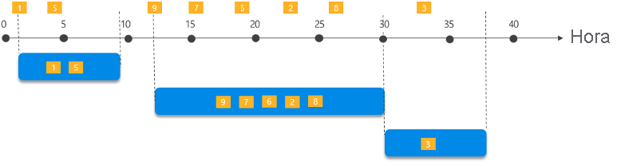

- La consulta siguiente mide la longitud de la sesión del usuario mediante la creación de `SessionWindow` sobre la información de la secuencia de clic con `timeoutsize` de 5 minutos y `maximumdurationsize` de 60 minutos.
```sql
-- Output the count of events that occur within 2 minutes of each other with a maximum duration of 60 minutes.
SELECT
    Username,
    MIN(ClickTime) AS WindowStart,
    System.Timestamp() AS WindowEnd,
    DATEDIFF(s, MIN(ClickTime), System.Timestamp()) AS DurationInSeconds
FROM Clickstream TIMESTAMP BY ClickTime
GROUP BY Username, SessionWindow(minute, 2, 60) OVER (PARTITION BY Username)
```
##### **Instantánea**
- Agrupan eventos por valores de marca de tiempo idénticos
- No emplean función de ventana específica. Usan una ventana de instantánea agregando `System.Timestamp()`

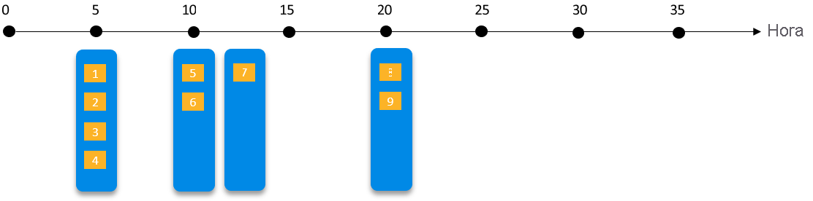
 
-  La consulta siguiente genera el recuento de eventos con el mismo nombre que se producen exactamente a la misma hora.

```sql
SELECT EventName, COUNT(*) AS Count
FROM EventStream TIMESTAMP BY EventTimestamp
GROUP BY EventName, System.Timestamp()
```